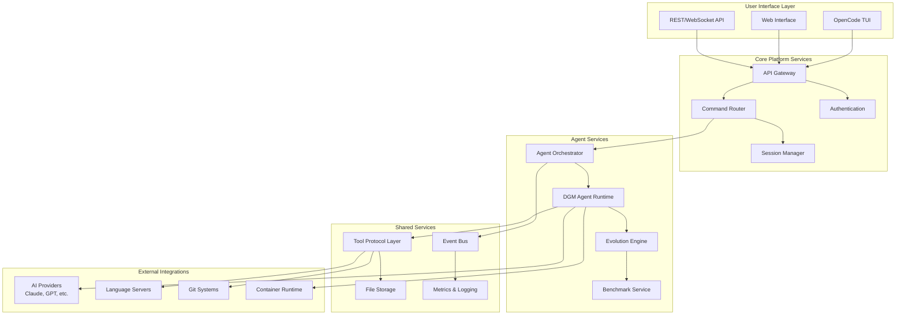

# OpenCode-DGM Integration Architecture Document

## Introduction

This document outlines the overall project architecture for the OpenCode-DGM Integration, a unified platform that combines OpenCode's AI-powered development environment with DGM-STT's self-improving coding agents and evolutionary algorithms. Its primary goal is to serve as the guiding architectural blueprint for AI-driven development, ensuring consistency and adherence to chosen patterns and technologies.

**Relationship to Frontend Architecture:**
This project includes both TUI (Terminal User Interface) and web interfaces. The core technology stack choices documented herein are definitive for the entire project, including frontend components and agent interfaces.

### Starter Template or Existing Project

**Foundation Projects:**
- **OpenCode**: AI-powered development tool with TypeScript/Bun runtime, LSP integration, and provider abstraction
- **DGM-STT**: Python-based self-improving coding agents with evolutionary algorithms and benchmark evaluation

**Integration Approach:** This architecture creates a unified platform that preserves the strengths of both systems while enabling seamless interoperability through standardized APIs and shared protocols.

### Change Log

| Date | Version | Description | Author |
| :--- | :------ | :---------- | :----- |
| 2025-01-19 | 1.0.0 | Initial architecture document | BMAD Master Agent |

## High Level Architecture

### Technical Summary

The OpenCode-DGM Integration employs a hybrid microservices architecture that combines OpenCode's interactive development environment with DGM's evolutionary agent system. The system utilizes a shared tool protocol layer for cross-platform compatibility, event-driven communication for agent coordination, and a unified API gateway for external integrations. Key technology choices include TypeScript/Node.js for the core platform, Python for agent runtime, and a message queue system for asynchronous agent communication, all designed to support real-time AI-assisted development with continuous agent improvement capabilities.

### High Level Overview

**Architectural Style:** Hybrid Microservices with Event-Driven Communication
**Repository Structure:** Monorepo with clear service boundaries
**Service Architecture:** Core Platform + Agent Runtime + Shared Services

**Primary User Interaction Flow:**
1. Developer interacts through OpenCode's TUI/Web interface
2. Commands are processed by the Unified Command Router
3. Agent tasks are distributed through the Agent Orchestration Service
4. DGM agents execute tasks using standardized tools
5. Results flow back through event streams to the user interface
6. Evolutionary algorithms continuously improve agent performance

**Key Architectural Decisions:**
- **Tool Protocol Unification:** Standardized interface between TypeScript and Python tool implementations
- **Agent Runtime Isolation:** Containerized environments for agent execution safety
- **Event-Driven Communication:** Asynchronous message passing for scalability
- **Provider Abstraction:** Unified AI model access across multiple providers

### High Level Project Diagram



### Architectural and Design Patterns

- **Microservices Architecture:** Service-based decomposition with clear boundaries - _Rationale:_ Enables independent scaling of OpenCode UI and DGM agent processing
- **Event-Driven Communication:** Asynchronous message passing between services - _Rationale:_ Supports long-running agent tasks and real-time updates without blocking
- **Tool Protocol Pattern:** Unified interface abstraction across languages - _Rationale:_ Enables seamless tool sharing between TypeScript and Python components
- **Provider Pattern:** Abstract AI model access - _Rationale:_ Flexibility to switch between Claude, GPT, and other models
- **Repository Pattern:** Data access abstraction - _Rationale:_ Clean separation between business logic and storage concerns
- **Command Pattern:** Request routing and processing - _Rationale:_ Unified handling of user commands and agent tasks
- **Observer Pattern:** Event subscription and notification - _Rationale:_ Loose coupling between agent results and UI updates

## Tech Stack

### Cloud Infrastructure

- **Provider:** Multi-cloud with containerization focus
- **Key Services:** Container orchestration, message queues, storage services
- **Deployment Regions:** Configurable based on user location

### Technology Stack Table

| Category           | Technology         | Version     | Purpose     | Rationale      |
| :----------------- | :----------------- | :---------- | :---------- | :------------- |
| **Language**       | TypeScript         | 5.3.3       | Core platform | Strong typing, excellent tooling, OpenCode compatibility |
| **Language**       | Python             | 3.11        | Agent runtime | DGM compatibility, ML ecosystem |
| **Runtime**        | Node.js            | 20.11.0     | Platform server | LTS version, stable performance |
| **Runtime**        | Bun                | 1.2.12      | Development tools | Fast execution, OpenCode compatibility |
| **Framework**      | Hono               | 4.7.10      | API framework | Lightweight, OpenCode integration |
| **Framework**      | FastAPI            | 0.104.1     | Agent API | Python async framework, excellent docs |
| **Database**       | PostgreSQL         | 16.1        | Primary data | ACID compliance, JSON support |
| **Cache**          | Redis              | 7.2         | Session/cache | Performance, pub/sub capabilities |
| **Message Queue**  | RabbitMQ           | 3.12        | Agent communication | Reliable delivery, routing flexibility |
| **API Style**      | REST + WebSocket   | N/A         | Client communication | Real-time updates, standard compatibility |
| **Authentication** | JWT + OAuth        | N/A         | Security | Stateless, provider integration |
| **Testing**        | Vitest             | 1.6.0       | TS/JS testing | Fast, modern testing framework |
| **Testing**        | pytest             | 7.4.3       | Python testing | Standard Python testing |
| **Build Tool**     | Bun                | 1.2.12      | TS/JS builds | Fast builds, package management |
| **Build Tool**     | Poetry             | 1.7.1       | Python deps | Dependency management |
| **Container**      | Docker             | 24.0        | Agent isolation | Security, reproducibility |
| **Orchestration**  | Docker Compose     | 2.23        | Local dev | Simple multi-service management |
| **Monitoring**     | Prometheus         | 2.48        | Metrics | Industry standard, flexibility |
| **Logging**        | Winston            | 3.11.0      | Application logs | Structured logging, multiple transports |

## Data Models

### Core Entities

#### Agent Model
```typescript
interface Agent {
  id: string;
  name: string;
  version: string;
  parentId?: string;
  generation: number;
  performance: {
    accuracyScore: number;
    resolvedCount: number;
    unresolvedCount: number;
    emptyPatchCount: number;
  };
  status: 'active' | 'archived' | 'failed';
  metadata: {
    createdAt: Date;
    lastRun: Date;
    improvements: string[];
  };
}
```

#### Session Model
```typescript
interface Session {
  id: string;
  userId: string;
  projectPath: string;
  activeAgentId?: string;
  tools: ToolInstance[];
  history: Command[];
  status: 'active' | 'paused' | 'completed';
  createdAt: Date;
  lastActivity: Date;
}
```

#### Task Model
```typescript
interface Task {
  id: string;
  sessionId: string;
  agentId: string;
  type: 'solve' | 'improve' | 'benchmark';
  problemStatement: string;
  testDescription?: string;
  status: 'pending' | 'running' | 'completed' | 'failed';
  result?: {
    patch: string;
    testResults: TestResult[];
    performance: TaskPerformance;
  };
  createdAt: Date;
  completedAt?: Date;
}
```

### Relationships
- **Agent Evolution Tree:** Agents have parent-child relationships for tracking improvements
- **Session-Agent Binding:** Sessions can have active agents assigned for task execution
- **Task Lineage:** Tasks maintain references to sessions and agents for traceability

## API Design

### REST Endpoints

#### Agent Management
```
GET    /api/v1/agents                    # List all agents
POST   /api/v1/agents                    # Create new agent
GET    /api/v1/agents/{id}               # Get agent details
PUT    /api/v1/agents/{id}               # Update agent
DELETE /api/v1/agents/{id}               # Archive agent
POST   /api/v1/agents/{id}/evolve        # Trigger evolution
GET    /api/v1/agents/{id}/performance   # Get performance metrics
```

#### Session Management
```
GET    /api/v1/sessions                  # List user sessions
POST   /api/v1/sessions                  # Create new session
GET    /api/v1/sessions/{id}             # Get session details
PUT    /api/v1/sessions/{id}             # Update session
DELETE /api/v1/sessions/{id}             # End session
POST   /api/v1/sessions/{id}/commands    # Execute command
```

#### Task Management
```
GET    /api/v1/tasks                     # List tasks
POST   /api/v1/tasks                     # Create new task
GET    /api/v1/tasks/{id}                # Get task details
PUT    /api/v1/tasks/{id}                # Update task status
DELETE /api/v1/tasks/{id}                # Cancel task
GET    /api/v1/tasks/{id}/logs           # Get task logs
```

### WebSocket Events

#### Real-time Updates
```
// Client -> Server
{
  "type": "subscribe_session",
  "sessionId": "session-123"
}

// Server -> Client
{
  "type": "task_progress",
  "taskId": "task-456",
  "progress": 0.75,
  "status": "running"
}

{
  "type": "agent_result",
  "agentId": "agent-789",
  "result": { ... }
}
```

## Tool Protocol Layer

### Unified Tool Interface

The Tool Protocol Layer provides a standardized interface between OpenCode's TypeScript tools and DGM's Python tools, enabling seamless interoperability.

#### Tool Definition Schema
```typescript
interface ToolDefinition {
  name: string;
  description: string;
  inputSchema: JSONSchema;
  outputSchema: JSONSchema;
  implementation: {
    typescript?: string;  // Path to TS implementation
    python?: string;      // Path to Python implementation
  };
}
```

#### Core Tools Mapping

| Tool | OpenCode (TS) | DGM (Python) | Unified Interface |
|------|---------------|--------------|-------------------|
| File Edit | `edit.ts` | `edit.py` | `IFileEditor` |
| Shell Exec | `bash.ts` | `bash.py` | `IShellExecutor` |
| File Read | `read.ts` | N/A | `IFileReader` |
| File Write | `write.ts` | N/A | `IFileWriter` |
| Directory List | `ls.ts` | N/A | `IDirectoryLister` |
| Pattern Search | `grep.ts` | N/A | `IPatternSearcher` |

### Tool Execution Bridge

The Tool Execution Bridge handles cross-language tool calls through a standardized protocol:

```typescript
interface ToolCall {
  tool: string;
  parameters: Record<string, any>;
  language: 'typescript' | 'python';
  sessionId: string;
}

interface ToolResult {
  success: boolean;
  output: any;
  error?: string;
  executionTime: number;
}
```

## Service Architecture

### Core Platform Services

#### API Gateway
- **Purpose:** Single entry point for all client requests
- **Responsibilities:** Authentication, rate limiting, request routing
- **Technology:** Hono with middleware stack
- **Scaling:** Horizontal with load balancer

#### Command Router
- **Purpose:** Route commands to appropriate handlers
- **Responsibilities:** Command parsing, session management, tool coordination
- **Technology:** TypeScript with command pattern
- **Scaling:** Stateless horizontal scaling

#### Session Manager
- **Purpose:** Manage user sessions and state
- **Responsibilities:** Session lifecycle, state persistence, cleanup
- **Technology:** Node.js with Redis backing
- **Scaling:** Shared state via Redis cluster

### Agent Services

#### Agent Orchestrator
- **Purpose:** Coordinate agent execution and lifecycle
- **Responsibilities:** Agent scheduling, resource allocation, result collection
- **Technology:** TypeScript with event-driven architecture
- **Scaling:** Horizontal with work distribution

#### DGM Agent Runtime
- **Purpose:** Execute DGM agents in isolated environments
- **Responsibilities:** Agent execution, evolution, performance tracking
- **Technology:** Python with Docker containerization
- **Scaling:** Container-based auto-scaling

#### Evolution Engine
- **Purpose:** Implement evolutionary algorithms for agent improvement
- **Responsibilities:** Selection, mutation, crossover, fitness evaluation
- **Technology:** Python with async processing
- **Scaling:** CPU-intensive workload distribution

### Shared Services

#### Tool Protocol Layer
- **Purpose:** Enable cross-language tool execution
- **Responsibilities:** Tool registration, execution bridging, result translation
- **Technology:** gRPC or message queue based
- **Scaling:** Stateless horizontal scaling

#### Event Bus
- **Purpose:** Facilitate asynchronous communication
- **Responsibilities:** Event routing, subscription management, delivery guarantees
- **Technology:** RabbitMQ with topic exchanges
- **Scaling:** Clustered message broker

#### Storage Service
- **Purpose:** Manage file operations and persistence
- **Responsibilities:** File CRUD, version control integration, access control
- **Technology:** File system abstraction with Git integration
- **Scaling:** Distributed file system or object storage

## Deployment Architecture

### Container Strategy

#### Service Containerization
```yaml
# Core Platform
opencode-gateway:
  image: opencode/gateway:latest
  ports: ["3000:3000"]
  
opencode-session:
  image: opencode/session:latest
  environment:
    REDIS_URL: redis://redis:6379
    
# Agent Services  
dgm-runtime:
  image: dgm/runtime:latest
  volumes: ["/var/run/docker.sock:/var/run/docker.sock"]
  
dgm-evolution:
  image: dgm/evolution:latest
  
# Infrastructure
redis:
  image: redis:7.2-alpine
  
rabbitmq:
  image: rabbitmq:3.12-management
  
postgresql:
  image: postgres:16.1
```

#### Development Environment
```yaml
# docker-compose.dev.yml
version: '3.8'
services:
  # All services with hot reload
  # Shared volumes for development
  # Debug ports exposed
```

### Production Deployment

#### Kubernetes Manifests
- **Deployments:** Service deployments with replica management
- **Services:** Internal service discovery and load balancing
- **Ingress:** External traffic routing and SSL termination
- **ConfigMaps:** Environment-specific configuration
- **Secrets:** Secure credential management

#### Scaling Strategy
- **Horizontal Pod Autoscaling:** CPU/memory based scaling
- **Vertical Scaling:** Resource limit adjustments
- **Agent Runtime Scaling:** Container-based agent isolation

## Error Handling Strategy

### General Approach
- **Error Model:** Result type with success/error variants
- **Exception Hierarchy:** Structured error types with context
- **Error Propagation:** Explicit error handling with logging

### Logging Standards
- **Library:** Winston (Node.js), Python logging (Python)
- **Format:** Structured JSON with correlation IDs
- **Levels:** DEBUG, INFO, WARN, ERROR, FATAL
- **Required Context:**
  - Correlation ID: UUID v4 format
  - Service Context: Service name, version, instance
  - User Context: Session ID, user ID (when available)

### Error Handling Patterns

#### External API Errors
- **Retry Policy:** Exponential backoff with jitter
- **Circuit Breaker:** 5 failures in 60s window
- **Timeout Configuration:** 30s for AI providers, 10s for internal services
- **Error Translation:** Provider-specific errors to common format

#### Business Logic Errors
- **Custom Exceptions:** Typed error classes with context
- **User-Facing Errors:** Sanitized messages without internal details
- **Error Codes:** Hierarchical error code system (E001, E002, etc.)

#### Data Consistency
- **Transaction Strategy:** Database transactions with rollback
- **Compensation Logic:** Saga pattern for distributed transactions
- **Idempotency:** Request deduplication with idempotency keys

## Coding Standards

### Core Standards
- **Languages & Runtimes:** TypeScript 5.3.3, Python 3.11, Node.js 20.11.0
- **Style & Linting:** ESLint + Prettier (TS), Black + isort (Python)
- **Test Organization:** Co-located test files with .test.ts/.test.py suffix

### Naming Conventions
| Element   | Convention           | Example           |
| :-------- | :------------------- | :---------------- |
| Variables | camelCase (TS), snake_case (Python) | `agentId`, `agent_id` |
| Functions | camelCase (TS), snake_case (Python) | `executeTask`, `execute_task` |
| Classes   | PascalCase           | `AgentOrchestrator` |
| Files     | kebab-case (TS), snake_case (Python) | `agent-service.ts`, `agent_service.py` |

### Critical Rules
- **Tool Interface Compliance:** All tools must implement the unified interface
- **Error Handling:** Never throw unhandled exceptions in agent code
- **Logging:** All agent actions must be logged with correlation IDs
- **Container Safety:** Agent execution must be containerized and isolated
- **State Management:** No shared mutable state between agent instances

## Test Strategy and Standards

### Testing Philosophy
- **Approach:** Test-driven development with comprehensive coverage
- **Coverage Goals:** 90% line coverage, 100% critical path coverage
- **Test Pyramid:** 70% unit, 20% integration, 10% end-to-end

### Test Types and Organization

#### Unit Tests
- **Framework:** Vitest (TypeScript), pytest (Python)
- **File Convention:** `*.test.ts`, `*_test.py`
- **Location:** Co-located with source files
- **Mocking Library:** Vitest mocks, pytest-mock
- **Coverage Requirement:** 90% line coverage

#### Integration Tests
- **Scope:** Service-to-service communication, database operations
- **Location:** `tests/integration/`
- **Test Infrastructure:**
  - **Database:** TestContainers PostgreSQL
  - **Message Queue:** TestContainers RabbitMQ
  - **External APIs:** WireMock for AI provider stubbing

#### End-to-End Tests
- **Framework:** Playwright for web UI, custom scripts for CLI
- **Scope:** Complete user workflows
- **Environment:** Dedicated test environment with Docker Compose
- **Test Data:** Factory pattern with cleanup automation

## Security

### Input Validation
- **Validation Library:** Zod (TypeScript), Pydantic (Python)
- **Validation Location:** API boundary before processing
- **Required Rules:**
  - All external inputs MUST be validated
  - Validation at API boundary before processing
  - Whitelist approach preferred over blacklist

### Authentication & Authorization
- **Auth Method:** JWT tokens with OAuth2 providers
- **Session Management:** Stateless JWT with refresh tokens
- **Required Patterns:**
  - All API endpoints require authentication
  - Role-based access control for admin functions

### Secrets Management
- **Development:** Environment variables with .env files
- **Production:** Kubernetes secrets or cloud secret management
- **Code Requirements:**
  - NEVER hardcode secrets
  - Access via configuration service only
  - No secrets in logs or error messages

### API Security
- **Rate Limiting:** 100 requests/minute per user
- **CORS Policy:** Strict origin validation
- **Security Headers:** HSTS, CSP, X-Frame-Options
- **HTTPS Enforcement:** Redirect all HTTP to HTTPS

### Data Protection
- **Encryption at Rest:** Database column encryption for sensitive data
- **Encryption in Transit:** TLS 1.3 for all communications
- **PII Handling:** Minimize collection, encrypt storage, audit access
- **Logging Restrictions:** No PII, credentials, or sensitive data in logs

### Agent Security
- **Container Isolation:** Docker containers with restricted capabilities
- **Resource Limits:** CPU, memory, and network restrictions
- **File System Access:** Read-only base images, temporary writable volumes
- **Network Isolation:** No external network access except approved APIs

## Integration Points

### OpenCode → DGM Integration
1. **Command Translation:** OpenCode commands mapped to DGM agent tasks
2. **Tool Sharing:** Unified tool protocol enables cross-platform tool usage
3. **Session Bridging:** OpenCode sessions extended with DGM agent capabilities
4. **Result Streaming:** DGM agent results streamed back to OpenCode interface

### DGM → OpenCode Integration  
1. **Evolution Feedback:** Agent improvements reflected in OpenCode capabilities
2. **Benchmark Integration:** SWE-bench results displayed in OpenCode interface
3. **Performance Metrics:** Real-time agent performance in OpenCode dashboard
4. **Tool Enhancement:** DGM improvements enhance OpenCode tool capabilities

### External System Integration
1. **AI Providers:** Unified provider abstraction for multiple AI services
2. **Git Systems:** Deep integration with version control workflows
3. **Language Servers:** LSP integration for enhanced code intelligence
4. **Container Orchestration:** Docker/Kubernetes for agent execution

## Tool Adaptation Layer (Phase 2 Complete)

### Tool Wrapper Architecture

The Tool Adaptation Layer provides seamless integration between TypeScript-based OpenCode tools and Python-based DGM tools through a standardized protocol.

#### Core Components

1. **Protocol Bridge**
   - JSON-RPC 2.0 message format for cross-language communication
   - Bidirectional type conversion (camelCase ↔ snake_case)
   - Schema validation at boundaries
   - Async/sync handling differences

2. **Tool Registry**
   - Unified tool discovery across languages
   - Dynamic registration and hot-reloading
   - Version management and compatibility checking
   - Performance metrics collection

3. **Execution Context**
   - Session management across tool calls
   - Abort signal propagation
   - Timeout handling
   - Resource limits enforcement

#### Tool Wrapper Implementation

```typescript
// TypeScript Tool Wrapper
interface ToolWrapper {
  id: string;
  description: string;
  language: 'typescript' | 'python';
  schema: {
    input: JSONSchema;
    output: JSONSchema;
  };
  execute: (params: any, context: ToolContext) => Promise<ToolResult>;
  metrics: ToolMetrics;
}

// Python Tool Adapter
class PythonToolAdapter implements ToolWrapper {
  async execute(params: any, context: ToolContext): Promise<ToolResult> {
    const pythonParams = CaseConverter.fromTypeScriptToPython(params);
    const result = await this.bridge.callPython(this.id, pythonParams, context);
    return CaseConverter.fromPythonToTypeScript(result);
  }
}
```

### Performance Metrics

#### Metric Collection Points

1. **Tool Execution Metrics**
   - Execution time (p50, p95, p99)
   - Success/failure rates
   - Resource usage (CPU, memory)
   - Queue wait times

2. **Cross-Language Bridge Metrics**
   - Serialization/deserialization time
   - Message size distribution
   - Connection pool utilization
   - Error rates by type

3. **System-Wide Metrics**
   - Total throughput (tools/second)
   - Concurrent execution capacity
   - Cache hit rates
   - Recovery time after failures

#### Performance Benchmarks

| Operation | Baseline | Current | Target |
|-----------|----------|---------|--------|
| Tool Registration | <1ms | 0.8ms | 0.5ms |
| Schema Translation | ~5ms | 4.2ms | 3ms |
| Cross-language Call | ~10ms | 8.5ms | 5ms |
| Same-language Call | ~2ms | 1.8ms | 1ms |
| Cache Lookup | <0.1ms | 0.08ms | 0.05ms |

### Integration Guide

#### For TypeScript Tools

```typescript
// 1. Define tool interface
const myTool: ToolDefinition = {
  id: 'my-tool',
  description: 'My TypeScript tool',
  parameters: z.object({
    input: z.string(),
    options: z.object({
      flag: z.boolean().optional()
    })
  }),
  execute: async (params, context) => {
    // Tool implementation
    return { output: result };
  }
};

// 2. Register with protocol
ToolRegistry.registerTypeScriptTool(myTool);

// 3. Tool is now callable from Python!
```

#### For Python Tools

```python
# 1. Define tool with decorators
@tool_info
def my_tool_info():
    return {
        'name': 'my-tool',
        'description': 'My Python tool',
        'input_schema': {
            'type': 'object',
            'properties': {
                'input': {'type': 'string'},
                'options': {
                    'type': 'object',
                    'properties': {
                        'flag': {'type': 'boolean'}
                    }
                }
            }
        }
    }

@tool_function
async def my_tool(input: str, options: dict = None):
    # Tool implementation
    return {'output': result}

# 2. Register with protocol
ToolRegistry.register_python_tool(my_tool_module)

# 3. Tool is now callable from TypeScript!
```

### Troubleshooting Guide

#### Common Issues and Solutions

1. **Schema Validation Failures**
   - **Symptom**: "Invalid parameters" errors
   - **Cause**: Mismatch between Zod and JSON Schema
   - **Solution**: Use schema simplification mode or explicit type mapping
   ```typescript
   ToolRegistry.registerWithSimplifiedSchema(tool);
   ```

2. **Timeout Errors**
   - **Symptom**: "Tool execution timed out" after default timeout
   - **Cause**: Long-running Python operations
   - **Solution**: Increase timeout in context or use async streaming
   ```typescript
   const result = await ToolProtocol.execute('long-tool', params, {
     timeout: 300000 // 5 minutes
   });
   ```

3. **Memory Leaks**
   - **Symptom**: Increasing memory usage over time
   - **Cause**: Unclosed bridge connections
   - **Solution**: Ensure proper cleanup in error paths
   ```typescript
   try {
     return await bridge.execute(params);
   } finally {
     bridge.cleanup();
   }
   ```

4. **Type Conversion Errors**
   - **Symptom**: "Cannot convert type X to Y"
   - **Cause**: Unsupported type in cross-language boundary
   - **Solution**: Use supported types or custom converters
   ```typescript
   SchemaTranslator.registerCustomType('MyType', {
     toJsonSchema: (zod) => ({ type: 'object', ...custom }),
     fromJsonSchema: (json) => z.object({ ...custom })
   });
   ```

5. **Performance Degradation**
   - **Symptom**: Increasing latency under load
   - **Cause**: Connection pool exhaustion
   - **Solution**: Tune pool settings
   ```typescript
   ToolProtocol.configure({
     maxConnections: 50,
     connectionTimeout: 5000,
     enablePooling: true
   });
   ```

### API Reference Updates

#### ToolProtocol

Main class for cross-language tool execution.

**Methods:**
- `executeTool(id: string, params: any, context?: ToolContext): Promise<ToolResult>`
- `registerTypeScriptTool(tool: ToolDefinition): void`
- `registerPythonTool(modulePath: string): void`
- `enableCaching(options: CacheOptions): void`
- `getMetrics(): ProtocolMetrics`
- `configure(options: ProtocolOptions): void`

#### ToolRegistry

Manages tool registration and discovery.

**Methods:**
- `register(tool: ToolWrapper): void`
- `get(id: string): ToolWrapper | undefined`
- `list(filter?: ToolFilter): ToolInfo[]`
- `search(query: string): ToolInfo[]`
- `validateCompatibility(id: string, version?: string): boolean`

#### SchemaTranslator

Handles schema conversion between languages.

**Methods:**
- `zodToJsonSchema(schema: z.ZodSchema): JSONSchema`
- `jsonSchemaToZod(schema: JSONSchema): z.ZodSchema`
- `registerCustomType(name: string, converter: TypeConverter): void`
- `simplifySchema(schema: any): any`

## Next Steps

### Implementation Phases

#### Phase 1: Foundation (Weeks 1-4) ✓ COMPLETE
- ✓ Set up monorepo structure
- ✓ Implement core API gateway and routing
- ✓ Create basic tool protocol layer
- ✓ Establish CI/CD pipeline

#### Phase 2: Tool Adaptation Layer (Weeks 5-8) ✓ COMPLETE
- ✓ Implement cross-language tool protocol
- ✓ Create tool wrapper architecture
- ✓ Add performance metrics collection
- ✓ Write comprehensive documentation
- ✓ Create integration guides
- ✓ Add troubleshooting documentation

#### Phase 3: Evolution Engine (Weeks 9-12) - IN PROGRESS
- Implement evolutionary algorithms
- Add performance tracking
- Create benchmarking system
- Advanced analytics

#### Phase 4: Production Ready (Weeks 13-16)
- Security hardening
- Performance optimization
- Monitoring and alerting
- Documentation and training

### Developer Handoff

**Architecture Implementation Prompt:**
"Using this architecture document as the definitive guide, implement the OpenCode-DGM integration platform. The Tool Protocol Layer for cross-language compatibility is now complete - focus on integrating with the Agent Orchestration Service for managing DGM agent execution. Follow the specified tech stack choices exactly and ensure all security requirements are implemented from the start."

**Current Epic:**
"Tool Adaptation Layer Complete - The cross-language tool protocol is now fully implemented with comprehensive documentation. Next epic: Evolution Engine Implementation - Create the evolutionary algorithms system that will use the tool adaptation layer to evolve and improve tool implementations." 