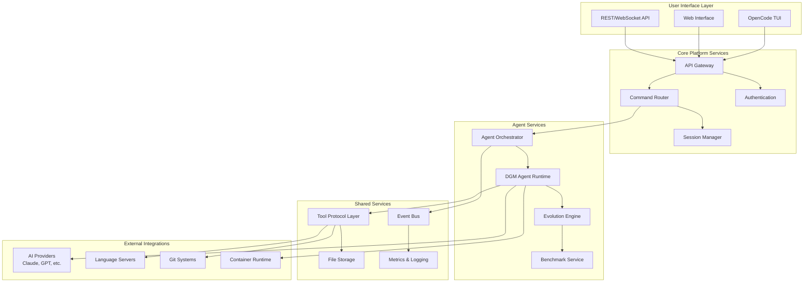

# OpenCode-DGM Integration Architecture Document

## Introduction

This document outlines the overall project architecture for the OpenCode-DGM Integration, a unified platform that combines OpenCode's AI-powered development environment with DGM-STT's self-improving coding agents and evolutionary algorithms. Its primary goal is to serve as the guiding architectural blueprint for AI-driven development, ensuring consistency and adherence to chosen patterns and technologies.

**Relationship to Frontend Architecture:**
This project includes both TUI (Terminal User Interface) and web interfaces. The core technology stack choices documented herein are definitive for the entire project, including frontend components and agent interfaces.

### Starter Template or Existing Project

**Foundation Projects:**
- **OpenCode**: AI-powered development tool with TypeScript/Bun runtime, LSP integration, and provider abstraction
- **DGM-STT**: Python-based self-improving coding agents with evolutionary algorithms and benchmark evaluation

**Integration Approach:** This architecture creates a unified platform that preserves the strengths of both systems while enabling seamless interoperability through standardized APIs and shared protocols.

### Change Log

| Date | Version | Description | Author |
| :--- | :------ | :---------- | :----- |
| 2025-01-19 | 1.0.0 | Initial architecture document | BMAD Master Agent |

## High Level Architecture

### Technical Summary

The OpenCode-DGM Integration employs a hybrid microservices architecture that combines OpenCode's interactive development environment with DGM's evolutionary agent system. The system utilizes a shared tool protocol layer for cross-platform compatibility, event-driven communication for agent coordination, and a unified API gateway for external integrations. Key technology choices include TypeScript/Node.js for the core platform, Python for agent runtime, and a message queue system for asynchronous agent communication, all designed to support real-time AI-assisted development with continuous agent improvement capabilities.

### High Level Overview

**Architectural Style:** Hybrid Microservices with Event-Driven Communication
**Repository Structure:** Monorepo with clear service boundaries
**Service Architecture:** Core Platform + Agent Runtime + Shared Services

**Primary User Interaction Flow:**
1. Developer interacts through OpenCode's TUI/Web interface
2. Commands are processed by the Unified Command Router
3. Agent tasks are distributed through the Agent Orchestration Service
4. DGM agents execute tasks using standardized tools
5. Results flow back through event streams to the user interface
6. Evolutionary algorithms continuously improve agent performance

**Key Architectural Decisions:**
- **Tool Protocol Unification:** Standardized interface between TypeScript and Python tool implementations
- **Agent Runtime Isolation:** Containerized environments for agent execution safety
- **Event-Driven Communication:** Asynchronous message passing for scalability
- **Provider Abstraction:** Unified AI model access across multiple providers

### High Level Project Diagram

### Architectural and Design Patterns

- **Microservices Architecture:** Service-based decomposition with clear boundaries - _Rationale:_ Enables independent scaling of OpenCode UI and DGM agent processing
- **Event-Driven Communication:** Asynchronous message passing between services - _Rationale:_ Supports long-running agent tasks and real-time updates without blocking
- **Tool Protocol Pattern:** Unified interface abstraction across languages - _Rationale:_ Enables seamless tool sharing between TypeScript and Python components
- **Provider Pattern:** Abstract AI model access - _Rationale:_ Flexibility to switch between Claude, GPT, and other models
- **Repository Pattern:** Data access abstraction - _Rationale:_ Clean separation between business logic and storage concerns
- **Command Pattern:** Request routing and processing - _Rationale:_ Unified handling of user commands and agent tasks
- **Observer Pattern:** Event subscription and notification - _Rationale:_ Loose coupling between agent results and UI updates

## Tech Stack

### Cloud Infrastructure

- **Provider:** Multi-cloud with containerization focus
- **Key Services:** Container orchestration, message queues, storage services
- **Deployment Regions:** Configurable based on user location

### Technology Stack Table

| Category           | Technology         | Version     | Purpose     | Rationale      |
| :----------------- | :----------------- | :---------- | :---------- | :------------- |
| **Language**       | TypeScript         | 5.3.3       | Core platform | Strong typing, excellent tooling, OpenCode compatibility |
| **Language**       | Python             | 3.11        | Agent runtime | DGM compatibility, ML ecosystem |
| **Runtime**        | Node.js            | 20.11.0     | Platform server | LTS version, stable performance |
| **Runtime**        | Bun                | 1.2.12      | Development tools | Fast execution, OpenCode compatibility |
| **Framework**      | Hono               | 4.7.10      | API framework | Lightweight, OpenCode integration |
| **Framework**      | FastAPI            | 0.104.1     | Agent API | Python async framework, excellent docs |
| **Database**       | PostgreSQL         | 16.1        | Primary data | ACID compliance, JSON support |
| **Cache**          | Redis              | 7.2         | Session/cache | Performance, pub/sub capabilities |
| **Message Queue**  | RabbitMQ           | 3.12        | Agent communication | Reliable delivery, routing flexibility |
| **API Style**      | REST + WebSocket   | N/A         | Client communication | Real-time updates, standard compatibility |
| **Authentication** | JWT + OAuth        | N/A         | Security | Stateless, provider integration |
| **Testing**        | Vitest             | 1.6.0       | TS/JS testing | Fast, modern testing framework |
| **Testing**        | pytest             | 7.4.3       | Python testing | Standard Python testing |
| **Build Tool**     | Bun                | 1.2.12      | TS/JS builds | Fast builds, package management |
| **Build Tool**     | Poetry             | 1.7.1       | Python deps | Dependency management |
| **Container**      | Docker             | 24.0        | Agent isolation | Security, reproducibility |
| **Orchestration**  | Docker Compose     | 2.23        | Local dev | Simple multi-service management |
| **Monitoring**     | Prometheus         | 2.48        | Metrics | Industry standard, flexibility |
| **Logging**        | Winston            | 3.11.0      | Application logs | Structured logging, multiple transports |

## Integration Summary

### Completed Analysis Results

**✅ OpenCode Codebase Analysis:**
- **Architecture:** TypeScript/Bun-based AI development tool
- **Core Components:** CLI system, tool abstractions, LSP integration, provider system
- **Capabilities:** Interactive development, AI assistance, authentication, file operations

**✅ DGM-STT Codebase Analysis:**
- **Architecture:** Python-based evolutionary coding system  
- **Core Components:** Agent runtime, evolution engine, benchmark system, tool implementations
- **Capabilities:** Self-improving agents, performance tracking, SWE-bench integration, problem solving

**✅ Integration Points Identified:**
- **Tool System Convergence:** Both implement similar tools (bash, edit, file ops)
- **AI Agent Integration:** OpenCode's interactive environment + DGM's autonomous agents
- **Development Workflow:** Real-time assistance + continuous improvement

**✅ Architecture Implementation Created:**
- **Hybrid Microservices:** Preserves strengths of both systems
- **Tool Protocol Layer:** Enables cross-language tool sharing
- **Event-Driven Communication:** Supports async agent coordination
- **Security & Isolation:** Containerized agent execution

## Next Steps

Based on this comprehensive architecture analysis, the integration is now ready for implementation. The architecture document provides:

1. **Clear technical foundation** with specific technology choices
2. **Detailed integration strategy** preserving both systems' strengths  
3. **Security considerations** for safe agent execution
4. **Scalable design patterns** for future growth
5. **Implementation roadmap** with phased approach

**Recommended Next Actions:**
1. Review architecture with development team
2. Set up initial monorepo structure
3. Begin Phase 1 implementation (Foundation Services)
4. Establish CI/CD pipeline and development workflows 