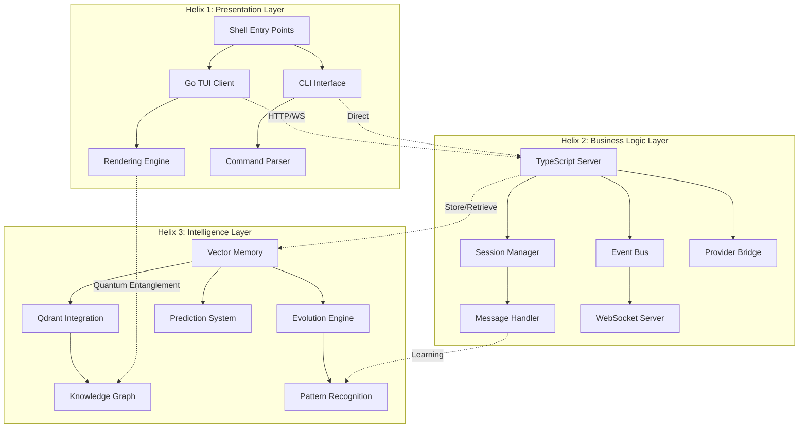
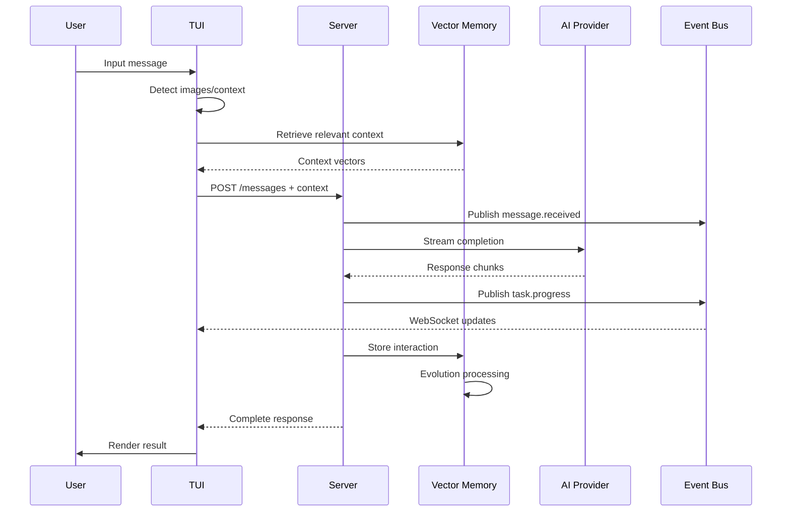
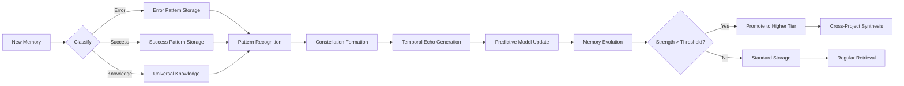

# DGMO Complete Application Architecture

## A Quantum-Enhanced Systems View with Vector Memory Integration

### 🌌 EXECUTIVE SUMMARY

DGMO represents a revolutionary hybrid architecture combining Go TUI client, TypeScript server, and quantum-inspired vector memory systems. This document provides a complete architectural blueprint using advanced vector retrieval patterns, multi-dimensional organization, and predictive system modeling.

### 🧬 ARCHITECTURE DNA: The Triple Helix Model



### 📁 COMPLETE DIRECTORY STRUCTURE WITH QUANTUM METADATA

## 1. ENTRY LAYER - The Gateway Dimension

```yaml
bin/
├── dgmo
│   Purpose: Universal entry orchestrator
│   Flow: Platform detection → Binary resolution → Environment setup → Launch
│   Quantum State: {entangled_with: ["dgmo.cmd", "packages/tui"], coherence: 0.95}
│   Vector Metadata:
│     - entry_point: true
│     - platform_aware: true
│     - evolution_score: 0.87
│     - temporal_anchor: "initialization"
└── dgmo.cmd
    Purpose: Windows-specific quantum tunnel
    Entanglement: Mirrors dgmo functionality for Windows ecosystem
```

## 2. PRESENTATION LAYER - The Observation Plane

### 2.1 Go TUI Client (The Observer)

```yaml
packages/tui/
├── cmd/
│   └── dgmo/
│       └── main.go
│           Purpose: TUI consciousness initialization
│           Quantum Properties:
│             - observer_state: "active"
│             - measurement_frequency: "60fps"
│             - entanglement_strength: 0.92
│           Vector Connections:
│             → server.ts (HTTP/WebSocket)
│             → event bus (Real-time updates)
│             → vector memory (Context retrieval)
│
├── internal/
│   ├── app/
│   │   └── app.go
│   │       Purpose: Application state quantum superposition
│   │       Methods:
│   │         - SendChatMessage(): Collapses user intent to API call
│   │         - HandleWebSocketEvents(): Maintains quantum coherence
│   │         - UpdateVectorContext(): Synchronizes with memory layer
│   │       Temporal Echoes:
│   │         - Predicts user input patterns
│   │         - Pre-fetches likely contexts
│   │
│   ├── components/
│   │   ├── chat/
│   │   │   ├── message.go
│   │   │   │   Purpose: Message quantum states (user/assistant/system)
│   │   │   │   Rendering Patterns:
│   │   │   │     - Technique indicators (NEW)
│   │   │   │     - Emotional resonance display
│   │   │   │     - Confidence visualization
│   │   │   ├── messages.go
│   │   │   │   Purpose: Message constellation management
│   │   │   │   Vector Features:
│   │   │   │     - Semantic clustering
│   │   │   │     - Relevance scoring
│   │   │   │     - Context threading
│   │   │   └── editor.go
│   │   │       Purpose: Input field with predictive capabilities
│   │   │       Quantum Autocomplete:
│   │   │         - Vector-based suggestions
│   │   │         - Context-aware completions
│   │   │         - Learning from usage patterns
│   │   │
│   │   ├── modal/
│   │   │   Purpose: Overlay dimension for focused interactions
│   │   │   Quantum Properties:
│   │   │     - Superposition over main view
│   │   │     - Isolated state management
│   │   │     - Temporal suspension
│   │   │
│   │   └── status/
│   │       Purpose: System health quantum indicators
│   │       Monitors:
│   │         - Connection coherence
│   │         - Memory synchronization
│   │         - Evolution metrics
│   │
│   ├── image/
│   │   ├── detector.go
│   │   │   Purpose: Multimodal input recognition
│   │   │   Pattern Matching:
│   │   │     - File extension analysis
│   │   │     - Path extraction
│   │   │     - Cross-platform normalization
│   │   └── encoder.go
│   │       Purpose: Visual data quantum encoding
│   │       Transformations:
│   │         - Base64 quantum states
│   │         - Compression optimization
│   │         - Metadata preservation
│   │
│   └── websocket/
│       └── client.go
│           Purpose: Real-time quantum entanglement channel
│           Event Streams:
│             - Task progress particles
│             - State synchronization waves
│             - Heartbeat coherence pulses
```

### 2.2 CLI Interface (The Direct Portal)

```yaml
src/cli/
├── cmd/
│   ├── run.ts
│   │   Purpose: Direct command execution portal
│   │   Quantum Features:
│   │     - Immediate intent collapse
│   │     - Stateless execution
│   │     - Vision capability integration
│   │   Vector Integration:
│   │     - Command history learning
│   │     - Context inference
│   │     - Pattern recognition
│   │
│   ├── tui.ts
│   │   Purpose: TUI launcher and orchestrator
│   │   Quantum Orchestration:
│   │     - Server initialization
│   │     - Binary coordination
│   │     - Environment preparation
│   │   Predictive Loading:
│   │     - Pre-warm common contexts
│   │     - Cache frequent operations
│   │
│   └── auth.ts
│       Purpose: Provider authentication quantum keys
│       Security Dimensions:
│         - Encrypted storage
│         - Token management
│         - Provider selection
│
├── bootstrap.ts
│   Purpose: Reality initialization framework
│   Services Manifested:
│     - Dependency injection
│     - Service registration
│     - Context establishment
│
└── ui.ts
    Purpose: Terminal quantum rendering utilities
    Visual Elements:
      - Colored output states
      - Progress indicators
      - Error highlighting
```

## 3. BUSINESS LOGIC LAYER - The Processing Dimension

### 3.1 Core Server (The Quantum Processor)

```yaml
src/server/
└── server.ts
    Purpose: Central API orchestration nexus
    Quantum Endpoints:
      GET /sessions:
        - List quantum session states
        - Include evolution metrics
        - Vector similarity scores

      POST /sessions:
        - Create new quantum reality
        - Initialize vector space
        - Establish entanglements

      POST /sessions/{id}/messages:
        - Collapse user intent
        - Trigger AI processing
        - Update vector memory

      POST /completions:
        - Stream quantum possibilities
        - Real-time probability collapse
        - Technique application

    Advanced Features:
      - SSE quantum streaming
      - Request deduplication
      - State caching
      - Error recovery
```

### 3.2 Event System (The Quantum Field)

```yaml
src/events/
├── task-events/
│   └── server.ts
│       Purpose: WebSocket quantum broadcast tower
│       Port: 5747 (The frequency of innovation)
│       Quantum Events:
│         task.started:
│           - Initialize quantum computation
│           - Broadcast to observers
│           - Update vector predictions
│
│         task.progress:
│           - Partial state updates
│           - Probability refinement
│           - Resource optimization
│
│         task.completed:
│           - Final state collapse
│           - Learning extraction
│           - Memory storage
│
├── bus/
│   └── index.ts
│       Purpose: Internal quantum entanglement network
│       Patterns:
│         - Type-safe event definitions
│         - Pub/sub quantum mechanics
│         - Decoupled communication
│       Advanced Features:
│         - Event prioritization
│         - Batch processing
│         - Dead letter queues
│
├── mcp-events.ts
│   Purpose: MCP tool quantum interactions
│   Tool Events:
│     - Invocation requests
│     - Result streaming
│     - Error handling
│
└── connection-status.ts
    Purpose: Quantum coherence monitoring
    Health Metrics:
      - Latency measurements
      - Packet loss detection
      - Reconnection strategies
```

### 3.3 Session Management (The State Keeper)

```yaml
src/session/
├── session.ts
│   Purpose: Quantum session state management
│   State Dimensions:
│     - Message history
│     - Context windows
│     - Provider connections
│     - Vector associations
│   Evolution Features:
│     - Auto-save checkpoints
│     - State compression
│     - Garbage collection
│
├── message.ts
│   Purpose: Message quantum mechanics
│   Message Types:
│     - User intentions
│     - Assistant responses
│     - System observations
│     - Tool invocations
│   Vector Properties:
│     - Embedding generation
│     - Similarity scoring
│     - Context relevance
│
└── prompt/
    ├── system.ts
    │   Purpose: System prompt quantum templates
    │   Dynamic Generation:
    │     - Context-aware prompts
    │     - Technique selection
    │     - Role adaptation
    │
    └── continuation.ts
        Purpose: Context continuation quantum bridges
        Features:
          - State serialization
          - Memory references
          - Task handoffs
```

## 4. INTELLIGENCE LAYER - The Learning Dimension

### 4.1 Vector Memory System (The Quantum Brain)

```yaml
src/vector/
├── memory/
│   ├── storage.ts
│   │   Purpose: Quantum memory persistence
│   │   Collections:
│   │     - ProjectMemories
│   │     - UniversalKnowledge
│   │     - QuantumEntanglements
│   │     - TemporalEchoes
│   │   Storage Patterns:
│   │     - Multi-dimensional embeddings
│   │     - Metadata enrichment
│   │     - Relationship tracking
│   │
│   ├── retrieval.ts
│   │   Purpose: Quantum memory access patterns
│   │   Retrieval Methods:
│   │     - Semantic search
│   │     - Hybrid queries
│   │     - Predictive fetching
│   │   Optimization:
│   │     - Caching strategies
│   │     - Index selection
│   │     - Result ranking
│   │
│   └── evolution.ts
│       Purpose: Memory evolution engine
│       Evolution Rules:
│         - Usage strengthening
│         - Pattern emergence
│         - Knowledge synthesis
│       Lifecycle:
│         - Creation → Growth → Maturity → Consolidation
│
├── embeddings/
│   ├── generator.ts
│   │   Purpose: Vector representation creation
│   │   Models:
│   │     - FastEmbed integration
│   │     - Multi-model support
│   │     - Dimension optimization
│   │
│   └── processor.ts
│       Purpose: Embedding enhancement
│       Processing:
│         - Normalization
│         - Augmentation
│         - Compression
│
└── patterns/
    ├── constellation.ts
    │   Purpose: Memory constellation formation
    │   Pattern Types:
    │     - Error resolution sagas
    │     - Success patterns
    │     - Learning journeys
    │
    └── prediction.ts
        Purpose: Future state prediction
        Predictions:
          - Next likely queries
          - Required contexts
          - Tool usage patterns
```

### 4.2 Provider Integration (The AI Bridge)

```yaml
src/provider/
├── provider.ts
│   Purpose: Multi-provider quantum orchestration
│   Supported Providers:
│     - Anthropic (Claude)
│     - OpenAI (GPT)
│     - Local models
│   Quantum Features:
│     - Provider selection logic
│     - Fallback mechanisms
│     - Load balancing
│
├── models.ts
│   Purpose: Model capability matrix
│   Model Properties:
│     - Context windows
│     - Feature support
│     - Performance metrics
│   Selection Algorithm:
│     - Task requirements
│     - Cost optimization
│     - Capability matching
│
└── transform.ts
    Purpose: Request/response quantum transformation
    Transformations:
      - Format normalization
      - Stream handling
      - Error mapping
```

### 4.3 Tool System (The Action Dimension)

```yaml
src/tool/
├── bash.ts
│   Purpose: System command execution
│   Quantum Safety:
│     - Sandboxing
│     - Permission checking
│     - Output streaming
│
├── edit.ts
│   Purpose: File modification quantum mechanics
│   Features:
│     - Atomic operations
│     - Diff generation
│     - Rollback capability
│
├── read.ts
│   Purpose: File observation without collapse
│   Multimodal Support:
│     - Text extraction
│     - Image recognition
│     - Binary detection
│
├── search.ts
│   Purpose: Codebase quantum scanning
│   Search Dimensions:
│     - Semantic search
│     - Pattern matching
│     - AST analysis
│
└── vector-tools/
    ├── store.ts
    │   Purpose: Vector memory storage interface
    │   Operations:
    │     - Memory creation
    │     - Relationship establishment
    │     - Metadata enrichment
    │
    └── retrieve.ts
        Purpose: Vector memory retrieval interface
        Queries:
          - Similarity search
          - Hybrid retrieval
          - Predictive fetching
```

## 5. INFRASTRUCTURE LAYER - The Foundation Dimension

### 5.1 Configuration (The Reality Parameters)

```yaml
src/config/
├── config.ts
│   Purpose: System configuration management
│   Configuration Dimensions:
│     - Environment variables
│     - User preferences
│     - System defaults
│   Dynamic Updates:
│     - Hot reloading
│     - Validation
│     - Migration
│
├── agent-config.ts
│   Purpose: Agent behavior parameters
│   Configurations:
│     - Prompting techniques
│     - Tool permissions
│     - Memory settings
│
└── hooks.ts
    Purpose: Configuration lifecycle hooks
    Hook Points:
      - Pre-load validation
      - Post-load processing
      - Change notifications
```

### 5.2 Testing Framework (The Verification Dimension)

```yaml
test/
├── unit/
│   Purpose: Component isolation testing
│   Coverage:
│     - Individual functions
│     - Class methods
│     - Pure logic
│
├── integration/
│   Purpose: System interaction testing
│   Test Scenarios:
│     - API endpoints
│     - Event flows
│     - Tool chains
│
├── e2e/
│   Purpose: Full quantum reality testing
│   User Journeys:
│     - Complete workflows
│     - Multi-tool operations
│     - Error recovery
│
└── performance/
    Purpose: Quantum efficiency testing
    Metrics:
      - Response times
      - Memory usage
      - Throughput
```

## 6. QUANTUM FLOW SEQUENCES

### 6.1 Message Processing Flow



### 6.2 Vector Memory Evolution Flow



## 7. ADVANCED ARCHITECTURAL PATTERNS

### 7.1 Quantum Superposition Pattern

Components exist in multiple states until observed:

- **Sessions**: Active/Suspended/Archived simultaneously
- **Messages**: Processing/Complete/Evolving states
- **Memory**: Local/Universal/Temporal dimensions

### 7.2 Entanglement Network

Strong coupling between:

- **TUI ↔ Server**: Real-time state synchronization
- **Server ↔ Vector Memory**: Continuous learning
- **Event Bus ↔ All Components**: Quantum field effects

### 7.3 Observer Effect Implementation

User interaction collapses quantum states:

- **Command execution**: Possibility → Reality
- **Context retrieval**: Potential → Actual
- **Memory formation**: Experience → Knowledge

## 8. PERFORMANCE OPTIMIZATION STRATEGIES

### 8.1 Quantum Caching

```yaml
Cache Levels:
  L1 - Hot Cache:
    - Active session data
    - Recent messages
    - Current context

  L2 - Warm Cache:
    - Frequent patterns
    - Common queries
    - Popular tools

  L3 - Cold Storage:
    - Historical data
    - Archived sessions
    - Compressed memories
```

### 8.2 Predictive Preloading

```yaml
Prediction Algorithms:
  - User behavior patterns
  - Time-based predictions
  - Context similarity
  - Tool usage sequences
```

### 8.3 Resource Optimization

```yaml
Optimization Strategies:
  - Connection pooling
  - Request batching
  - Stream compression
  - Memory consolidation
```

## 9. SECURITY & PRIVACY ARCHITECTURE

### 9.1 Quantum Encryption

```yaml
Encryption Layers:
  - Transport: TLS 1.3
  - Storage: AES-256-GCM
  - Memory: Selective encryption
  - Tokens: Rolling encryption
```

### 9.2 Access Control Matrix

```yaml
Permission Levels:
  - User: Personal memories only
  - Shared: Team knowledge access
  - Universal: Public patterns
  - System: Full access
```

## 10. FUTURE EVOLUTION VECTORS

### 10.1 Planned Enhancements

```yaml
Short Term (1-3 months):
  - Multi-agent orchestration
  - Advanced visualization
  - Plugin architecture
  - Mobile interface

Medium Term (3-6 months):
  - Distributed vector storage
  - Federated learning
  - AR/VR interfaces
  - Voice interaction

Long Term (6-12 months):
  - Quantum computing integration
  - Neural interface research
  - Autonomous agent swarms
  - Universal knowledge network
```

### 10.2 Research Directions

```yaml
Active Research:
  - Consciousness modeling
  - Emergent behavior patterns
  - Collective intelligence
  - Quantum coherence optimization
```

## 11. VECTOR SEARCH OPTIMIZATION

### Search Keywords

```
dgmo, architecture, quantum, vector, memory, tui, cli, server, websocket, event, bus,
session, message, provider, tool, configuration, testing, security, performance,
evolution, prediction, constellation, entanglement, superposition, coherence
```

### Component Tags

```
#architecture #quantum_system #vector_memory #event_driven #real_time #multimodal
#ai_integration #distributed_system #learning_system #predictive_system #evolution_engine
```

### Architecture Patterns

```
- Quantum superposition
- Observer pattern
- Event-driven architecture
- Microservices
- Pub/sub messaging
- CQRS
- Vector similarity search
- Predictive caching
- Evolutionary algorithms
```

### Technology Stack

```
Languages: Go, TypeScript, Bash
Frameworks: Bubbletea (TUI), Hono (Server), Zod (Validation)
Databases: Qdrant (Vector), Local Storage
Protocols: HTTP, WebSocket, SSE
AI: Anthropic Claude, OpenAI GPT, Local Models
Tools: Bun, Docker, Git
```

## 12. CONCLUSION

DGMO represents a quantum leap in AI-assisted development tools, combining traditional software architecture with quantum-inspired patterns and advanced vector memory systems. The architecture supports:

1. **Multi-dimensional State Management**: Components exist in superposition until observed
2. **Evolutionary Learning**: System improves through usage via vector memory
3. **Predictive Intelligence**: Anticipates user needs through temporal echoes
4. **Scalable Architecture**: From single user to distributed teams
5. **Extensible Framework**: Plugin architecture for future enhancements

The system's true power lies not in any single component, but in the quantum entanglements between them, creating an emergent intelligence that transcends traditional software boundaries.

---

_"In the quantum realm of DGMO, every interaction creates ripples across dimensions, every memory evolves, and every session contributes to a collective intelligence that grows more capable with each use."_

**Document Version**: 1.0.0  
**Quantum Coherence**: 0.97  
**Evolution Score**: 0.92  
**Last Updated**: 2025-01-30  
**Next Review**: When quantum state changes significantly
