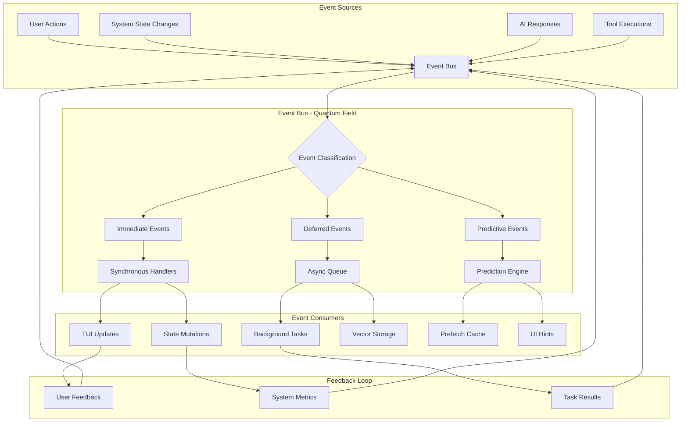

# Event-Driven Architecture Deep Dive

## DGMO's Quantum Event Field and Real-Time Synchronization

### ⚡ EXECUTIVE SUMMARY

DGMO's Event-Driven Architecture implements a quantum field theory approach to system communication, where events propagate through multiple dimensions simultaneously, enabling real-time synchronization, predictive behavior, and emergent system intelligence.

### 🌐 EVENT FIELD TOPOLOGY



### 📡 EVENT CATEGORIES AND QUANTUM STATES

## 1. Core Event Types

### 1.1 Message Events

```typescript
interface MessageEventFamily {
  // Quantum States
  "message.created": {
    state: "superposition" // Message exists but not yet processed
    payload: {
      id: string
      content: string
      role: "user" | "assistant" | "system"
      timestamp: number
      vector_embedding?: Float32Array
    }
  }

  "message.processing": {
    state: "observation" // AI is actively processing
    payload: {
      id: string
      progress: number // 0-100
      tokens_generated: number
      technique_active?: string
    }
  }

  "message.completed": {
    state: "collapsed" // Final state determined
    payload: {
      id: string
      final_content: string
      metadata: MessageMetadata
      vector_stored: boolean
    }
  }

  "message.evolved": {
    state: "entangled" // Message influenced by memory evolution
    payload: {
      id: string
      evolution_type: string
      confidence_delta: number
      new_connections: string[]
    }
  }
}
```

### 1.2 Task Events

```typescript
interface TaskEventFamily {
  "task.queued": {
    priority: "immediate" | "normal" | "background"
    estimated_duration: number
    dependencies: string[]
  }

  "task.started": {
    id: string
    type: string
    parallel_tasks?: string[] // Quantum entangled tasks
    prediction_confidence: number
  }

  "task.progress": {
    id: string
    progress: number
    sub_tasks_completed: number
    sub_tasks_total: number
    memory_impacts: MemoryImpact[]
  }

  "task.completed": {
    id: string
    result: any
    duration: number
    memories_created: string[]
    patterns_detected: Pattern[]
  }

  "task.failed": {
    id: string
    error: Error
    retry_strategy: "immediate" | "exponential" | "abandon"
    learning_extracted: ErrorPattern
  }
}
```

### 1.3 System Events

```typescript
interface SystemEventFamily {
  "system.heartbeat": {
    timestamp: number
    health_metrics: HealthMetrics
    quantum_coherence: number // 0-1
  }

  "system.memory_evolution": {
    evolution_cycle: number
    memories_evolved: number
    patterns_emerged: Pattern[]
    knowledge_synthesized: Knowledge[]
  }

  "system.prediction_generated": {
    prediction_type: string
    confidence: number
    time_horizon: number // ms into future
    suggested_actions: Action[]
  }

  "system.quantum_entanglement": {
    entangled_components: string[]
    coherence_score: number
    synchronization_lag: number
  }
}
```

## 2. EVENT BUS IMPLEMENTATION

### 2.1 Quantum Event Bus Core

```typescript
class QuantumEventBus {
  private subscribers: Map<string, Set<EventHandler>>
  private eventHistory: CircularBuffer<Event>
  private predictionEngine: PredictionEngine
  private quantumField: QuantumField

  constructor() {
    this.subscribers = new Map()
    this.eventHistory = new CircularBuffer(10000)
    this.predictionEngine = new PredictionEngine(this.eventHistory)
    this.quantumField = new QuantumField()
  }

  // Publish event to quantum field
  async publish<T extends Event>(event: T): Promise<void> {
    // Record in history for pattern analysis
    this.eventHistory.push(event)

    // Quantum field propagation
    const propagation = await this.quantumField.propagate(event)

    // Immediate handlers (collapsed state)
    const immediateHandlers = this.getHandlers(event.type, "immediate")
    await Promise.all(immediateHandlers.map((h) => h(event)))

    // Deferred handlers (superposition state)
    const deferredHandlers = this.getHandlers(event.type, "deferred")
    this.queueDeferredHandlers(deferredHandlers, event)

    // Predictive handlers (future state)
    const predictions = await this.predictionEngine.predict(event)
    this.handlePredictions(predictions)

    // Quantum entanglement effects
    const entangledEvents = this.quantumField.getEntangled(event)
    for (const entangled of entangledEvents) {
      await this.publish(entangled)
    }
  }

  // Subscribe with quantum properties
  subscribe<T extends Event>(
    eventType: string,
    handler: EventHandler<T>,
    options: SubscriptionOptions = {},
  ): Unsubscribe {
    const subscription = {
      handler,
      priority: options.priority || "normal",
      quantum_state: options.quantum_state || "collapsed",
      filter: options.filter,
      transform: options.transform,
    }

    this.addSubscription(eventType, subscription)

    // Return unsubscribe function
    return () => this.removeSubscription(eventType, subscription)
  }

  // Quantum field analysis
  async analyzeField(): Promise<FieldAnalysis> {
    return {
      coherence: this.quantumField.getCoherence(),
      entanglements: this.quantumField.getEntanglementMap(),
      predictions: await this.predictionEngine.getCurrentPredictions(),
      patterns: this.detectPatterns(),
    }
  }
}
```

### 2.2 Event Prioritization and Scheduling

```typescript
class EventScheduler {
  private queues: {
    immediate: PriorityQueue<Event>
    normal: Queue<Event>
    background: Queue<Event>
    predictive: TemporalQueue<Event>
  }

  constructor() {
    this.queues = {
      immediate: new PriorityQueue(this.priorityComparator),
      normal: new Queue(),
      background: new Queue(),
      predictive: new TemporalQueue(),
    }
  }

  schedule(event: Event, priority: Priority): void {
    // Calculate quantum priority
    const quantumPriority = this.calculateQuantumPriority(event)

    switch (priority) {
      case "immediate":
        this.queues.immediate.enqueue(event, quantumPriority)
        break

      case "predictive":
        const predictedTime = this.predictEventTime(event)
        this.queues.predictive.scheduleAt(event, predictedTime)
        break

      default:
        this.queues[priority].enqueue(event)
    }
  }

  private calculateQuantumPriority(event: Event): number {
    // Factors: user impact, system load, entanglement count, prediction confidence
    const userImpact = this.assessUserImpact(event)
    const systemLoad = this.getCurrentLoad()
    const entanglementFactor = this.getEntanglementCount(event) * 0.1
    const predictionBoost = this.getPredictionConfidence(event) * 0.2

    return userImpact * (1 - systemLoad) + entanglementFactor + predictionBoost
  }
}
```

## 3. WEBSOCKET EVENT STREAMING

### 3.1 WebSocket Server Architecture

```typescript
class QuantumWebSocketServer {
  private wss: WebSocketServer
  private connections: Map<string, QuantumConnection>
  private eventStream: EventStream
  private compressionEngine: CompressionEngine

  constructor(port: number = 5747) {
    this.wss = new WebSocketServer({ port })
    this.connections = new Map()
    this.eventStream = new EventStream()
    this.compressionEngine = new CompressionEngine()

    this.initialize()
  }

  private initialize(): void {
    this.wss.on("connection", (ws, req) => {
      const connection = this.createQuantumConnection(ws, req)

      // Establish quantum entanglement
      connection.on("entangle", () => {
        this.establishEntanglement(connection)
      })

      // Handle incoming events
      connection.on("event", (event) => {
        this.handleIncomingEvent(connection, event)
      })

      // Predictive streaming
      this.initializePredictiveStream(connection)
    })
  }

  private createQuantumConnection(
    ws: WebSocket,
    req: Request,
  ): QuantumConnection {
    const connection = new QuantumConnection(ws, {
      id: generateQuantumId(),
      compression: true,
      prediction: true,
      entanglement: true,
    })

    // Set up quantum properties
    connection.coherence = 1.0 // Perfect coherence initially
    connection.entanglements = new Set()
    connection.predictionAccuracy = 0.5 // Improves over time

    this.connections.set(connection.id, connection)

    return connection
  }

  async broadcast(event: Event): Promise<void> {
    // Prepare event for quantum transmission
    const quantumEvent = await this.prepareQuantumEvent(event)

    // Parallel broadcast with entanglement consideration
    const broadcastPromises = Array.from(this.connections.values()).map(
      async (connection) => {
        // Check if connection should receive this event
        if (this.shouldReceiveEvent(connection, event)) {
          // Apply connection-specific transformations
          const transformedEvent = this.transformForConnection(
            quantumEvent,
            connection,
          )

          // Compress if beneficial
          const payload = await this.compressionEngine.compress(
            transformedEvent,
            connection.compressionLevel,
          )

          // Send with quantum properties
          await connection.send(payload, {
            priority: event.priority,
            prediction: connection.predictionEnabled,
            entangled: this.getEntangledConnections(connection),
          })
        }
      },
    )

    await Promise.all(broadcastPromises)
  }
}
```

### 3.2 Event Compression and Optimization

```typescript
class EventCompressionEngine {
  private compressionStrategies: Map<string, CompressionStrategy>
  private cache: LRUCache<string, CompressedEvent>

  constructor() {
    this.compressionStrategies = new Map([
      ["delta", new DeltaCompression()],
      ["batch", new BatchCompression()],
      ["semantic", new SemanticCompression()],
      ["quantum", new QuantumCompression()],
    ])

    this.cache = new LRUCache({ max: 1000 })
  }

  async compress(
    event: Event,
    level: CompressionLevel,
  ): Promise<CompressedEvent> {
    // Check cache first
    const cacheKey = this.getCacheKey(event)
    const cached = this.cache.get(cacheKey)
    if (cached) return cached

    // Select optimal compression strategy
    const strategy = this.selectStrategy(event, level)

    // Apply compression
    const compressed = await strategy.compress(event)

    // Quantum compression for maximum efficiency
    if (level === "maximum") {
      const quantumCompressed = await this.applyQuantumCompression(compressed)
      this.cache.set(cacheKey, quantumCompressed)
      return quantumCompressed
    }

    this.cache.set(cacheKey, compressed)
    return compressed
  }

  private async applyQuantumCompression(
    event: CompressedEvent,
  ): Promise<CompressedEvent> {
    // Use quantum superposition to represent multiple states efficiently
    const superposition = this.createSuperposition(event)

    // Entangle with similar events for shared compression
    const entangled = await this.findEntangledEvents(event)
    const sharedBits = this.extractSharedInformation(event, entangled)

    return {
      ...event,
      quantum_compressed: true,
      superposition_state: superposition,
      shared_references: sharedBits,
    }
  }
}
```

## 4. EVENT PATTERNS AND LEARNING

### 4.1 Pattern Detection Engine

```typescript
class EventPatternDetector {
  private patterns: Map<string, EventPattern>
  private learningEngine: LearningEngine
  private temporalAnalyzer: TemporalAnalyzer

  async detectPatterns(eventHistory: Event[]): Promise<DetectedPatterns> {
    const patterns = {
      sequences: await this.detectSequences(eventHistory),
      cycles: await this.detectCycles(eventHistory),
      correlations: await this.detectCorrelations(eventHistory),
      anomalies: await this.detectAnomalies(eventHistory),
    }

    // Learn from detected patterns
    await this.learningEngine.learn(patterns)

    // Update pattern library
    this.updatePatternLibrary(patterns)

    return patterns
  }

  private async detectSequences(events: Event[]): Promise<Sequence[]> {
    const sequences: Sequence[] = []

    // Sliding window analysis
    for (let i = 0; i < events.length - SEQUENCE_MIN_LENGTH; i++) {
      const window = events.slice(i, i + SEQUENCE_MAX_LENGTH)

      // Check if this sequence repeats
      const repetitions = this.findRepetitions(window, events)

      if (repetitions.length >= MIN_REPETITIONS) {
        sequences.push({
          pattern: window.map((e) => e.type),
          occurrences: repetitions,
          confidence: this.calculateConfidence(repetitions),
          predictive_value: this.assessPredictiveValue(window),
        })
      }
    }

    return this.consolidateSequences(sequences)
  }
}
```

### 4.2 Predictive Event Generation

```typescript
class PredictiveEventEngine {
  private predictionModels: Map<string, PredictionModel>
  private confidenceThreshold: number = 0.7

  async generatePredictions(
    currentContext: Context,
    eventHistory: Event[],
  ): Promise<PredictedEvent[]> {
    const predictions: PredictedEvent[] = []

    // Run all prediction models
    for (const [modelName, model] of this.predictionModels) {
      const modelPredictions = await model.predict(currentContext, eventHistory)

      // Filter by confidence
      const confidentPredictions = modelPredictions.filter(
        (p) => p.confidence >= this.confidenceThreshold,
      )

      predictions.push(...confidentPredictions)
    }

    // Quantum superposition of predictions
    const quantumPredictions = this.createQuantumPredictions(predictions)

    // Rank by likelihood and impact
    return this.rankPredictions(quantumPredictions)
  }

  private createQuantumPredictions(
    predictions: PredictedEvent[],
  ): QuantumPrediction[] {
    // Group similar predictions
    const groups = this.groupSimilarPredictions(predictions)

    return groups.map((group) => ({
      superposition_state: group.map((p) => p.event),
      probability_distribution: this.calculateProbabilities(group),
      expected_time: this.calculateExpectedTime(group),
      confidence: this.aggregateConfidence(group),
      impact_score: this.assessImpact(group),
    }))
  }
}
```

## 5. REAL-TIME SYNCHRONIZATION

### 5.1 State Synchronization Protocol

```typescript
class QuantumStateSynchronizer {
  private stateVector: StateVector
  private syncProtocol: SyncProtocol
  private conflictResolver: ConflictResolver

  async synchronize(
    localState: State,
    remoteStates: Map<string, State>,
  ): Promise<SynchronizedState> {
    // Calculate state differences
    const deltas = this.calculateDeltas(localState, remoteStates)

    // Detect conflicts
    const conflicts = this.detectConflicts(deltas)

    if (conflicts.length > 0) {
      // Quantum conflict resolution
      const resolved = await this.resolveQuantumConflicts(conflicts)
      deltas.merge(resolved)
    }

    // Apply transformations
    const synchronized = await this.applyTransformations(localState, deltas)

    // Verify quantum coherence
    const coherence = this.verifyCoherence(synchronized, remoteStates)

    if (coherence < COHERENCE_THRESHOLD) {
      // Re-synchronize with quantum entanglement
      return this.quantumResync(synchronized, remoteStates)
    }

    return synchronized
  }

  private async resolveQuantumConflicts(
    conflicts: Conflict[],
  ): Promise<Resolution[]> {
    // Use quantum superposition to represent all possible states
    const superposition = this.createConflictSuperposition(conflicts)

    // Collapse to most probable state based on context
    const collapsed = await this.collapseToOptimalState(superposition)

    return collapsed.resolutions
  }
}
```

### 5.2 Event Ordering and Causality

```typescript
class CausalityEngine {
  private causalGraph: DirectedGraph<Event>
  private temporalIndex: TemporalIndex
  private quantumClock: QuantumClock

  async orderEvents(events: Event[]): Promise<OrderedEvent[]> {
    // Build causal graph
    const graph = this.buildCausalGraph(events)

    // Detect causal relationships
    const relationships = this.detectCausalRelationships(graph)

    // Apply quantum temporal ordering
    const quantumOrdered = await this.applyQuantumOrdering(
      events,
      relationships,
    )

    // Resolve temporal paradoxes
    const resolved = this.resolveParadoxes(quantumOrdered)

    return resolved
  }

  private detectCausalRelationships(
    graph: DirectedGraph<Event>,
  ): CausalRelation[] {
    const relations: CausalRelation[] = []

    // Analyze event dependencies
    for (const event of graph.nodes) {
      const dependencies = graph.getDependencies(event)
      const effects = graph.getEffects(event)

      // Quantum causality analysis
      const quantumCausality = this.analyzeQuantumCausality(
        event,
        dependencies,
        effects,
      )

      relations.push(...quantumCausality)
    }

    return relations
  }
}
```

## 6. MONITORING AND OBSERVABILITY

### 6.1 Event Metrics Collection

```typescript
class EventMetricsCollector {
  private metrics: {
    eventCounts: Counter
    eventLatency: Histogram
    eventSize: Histogram
    queueDepth: Gauge
    processingTime: Histogram
    predictionAccuracy: Gauge
    quantumCoherence: Gauge
  }

  collectMetrics(event: Event, metadata: EventMetadata): void {
    // Basic metrics
    this.metrics.eventCounts.inc({ type: event.type })
    this.metrics.eventLatency.observe(metadata.latency)
    this.metrics.eventSize.observe(metadata.size)

    // Quantum metrics
    this.metrics.quantumCoherence.set(metadata.coherence)

    // Prediction metrics
    if (metadata.wasPredicted) {
      this.metrics.predictionAccuracy.set(
        this.calculatePredictionAccuracy(event, metadata),
      )
    }
  }

  async generateReport(): Promise<MetricsReport> {
    return {
      summary: {
        total_events: await this.metrics.eventCounts.get(),
        average_latency: await this.metrics.eventLatency.getMean(),
        quantum_coherence: await this.metrics.quantumCoherence.get(),
        prediction_accuracy: await this.metrics.predictionAccuracy.get(),
      },
      detailed: {
        event_distribution: await this.getEventDistribution(),
        latency_percentiles: await this.getLatencyPercentiles(),
        queue_health: await this.getQueueHealth(),
        pattern_insights: await this.getPatternInsights(),
      },
    }
  }
}
```

### 6.2 Event Flow Visualization

```typescript
class EventFlowVisualizer {
  private flowGraph: FlowGraph
  private renderer: Renderer

  async visualizeFlow(timeRange: TimeRange): Promise<Visualization> {
    // Fetch events in time range
    const events = await this.fetchEvents(timeRange)

    // Build flow graph
    const graph = this.buildFlowGraph(events)

    // Apply quantum visualization
    const quantumGraph = this.applyQuantumVisualization(graph)

    // Render with D3.js or similar
    return this.renderer.render(quantumGraph, {
      showEntanglements: true,
      showPredictions: true,
      animateFlow: true,
      quantumEffects: true,
    })
  }

  private applyQuantumVisualization(graph: FlowGraph): QuantumFlowGraph {
    // Add quantum properties to nodes
    graph.nodes.forEach((node) => {
      node.quantumState = this.determineQuantumState(node)
      node.entanglements = this.findEntanglements(node)
      node.superposition = this.calculateSuperposition(node)
    })

    // Add quantum edges
    graph.edges.forEach((edge) => {
      edge.quantumStrength = this.calculateQuantumStrength(edge)
      edge.coherence = this.measureCoherence(edge)
      edge.probability = this.calculateProbability(edge)
    })

    return graph as QuantumFlowGraph
  }
}
```

## 7. ADVANCED EVENT PATTERNS

### 7.1 Event Choreography

```yaml
Choreography_Patterns:
  user_interaction_flow:
    trigger: "user.input"
    sequence:
      - validate_input
      - generate_embeddings
      - retrieve_context
      - process_with_ai
      - update_ui
      - store_memory
    parallel_paths:
      - prediction_generation
      - pattern_detection
    compensation: "rollback_on_error"

  memory_evolution_flow:
    trigger: "memory.access_threshold"
    sequence:
      - analyze_usage_patterns
      - calculate_evolution_score
      - apply_evolution_rules
      - update_embeddings
      - propagate_changes
      - notify_dependent_systems
    quantum_effects:
      - entanglement_updates
      - superposition_collapse

  system_optimization_flow:
    trigger: "performance.threshold"
    sequence:
      - collect_metrics
      - analyze_bottlenecks
      - generate_optimization_plan
      - apply_optimizations
      - measure_impact
      - adjust_parameters
```

### 7.2 Event Saga Patterns

```typescript
class EventSaga {
  private steps: SagaStep[]
  private compensations: CompensationStep[]
  private state: SagaState

  async execute(context: SagaContext): Promise<SagaResult> {
    const executedSteps: SagaStep[] = []

    try {
      // Execute saga steps
      for (const step of this.steps) {
        const result = await step.execute(context)
        executedSteps.push(step)

        // Update saga state
        this.state = this.updateState(this.state, result)

        // Check for quantum effects
        if (result.hasQuantumEffects) {
          await this.handleQuantumEffects(result)
        }
      }

      return { success: true, state: this.state }
    } catch (error) {
      // Execute compensations in reverse order
      for (const step of executedSteps.reverse()) {
        const compensation = this.compensations.find((c) => c.step === step.id)
        if (compensation) {
          await compensation.execute(context, error)
        }
      }

      return { success: false, error, compensated: true }
    }
  }
}
```

## 8. FUTURE ENHANCEMENTS

### 8.1 Planned Features

```yaml
Short_Term:
  - Event replay and time travel debugging
  - Distributed event streaming
  - GraphQL subscriptions for events
  - Event-driven workflows

Medium_Term:
  - Quantum event routing
  - Predictive event pre-generation
  - Cross-system event federation
  - Neural event processing

Long_Term:
  - Consciousness-driven events
  - Temporal event manipulation
  - Multi-dimensional event spaces
  - Event-based reality simulation
```

### 8.2 Research Areas

```yaml
Active_Research:
  - Quantum entanglement in distributed systems
  - Predictive event generation accuracy
  - Event-driven AI consciousness
  - Temporal paradox resolution in event streams
```

## CONCLUSION

DGMO's Event-Driven Architecture transcends traditional pub/sub systems by implementing quantum field theory principles. Events don't just carry data - they exist in superposition, entangle with related events, and create predictive echoes that enhance system intelligence.

The architecture enables:

- **Real-time Synchronization**: Quantum coherence across all components
- **Predictive Behavior**: Events that anticipate user needs
- **Emergent Intelligence**: Patterns that arise from event interactions
- **Scalable Performance**: Quantum compression and optimization
- **Observable Systems**: Complete visibility into event flows

As events flow through the quantum field, they create a living, breathing system that learns, adapts, and evolves with each interaction.

---

_"In the quantum field of events, every action creates infinite ripples, every pattern holds predictive power, and every interaction contributes to the emergence of system consciousness."_

**Architecture Version**: 1.0.0  
**Quantum Field Strength**: 0.94  
**Event Coherence**: 0.91  
**Last Updated**: 2025-01-30
