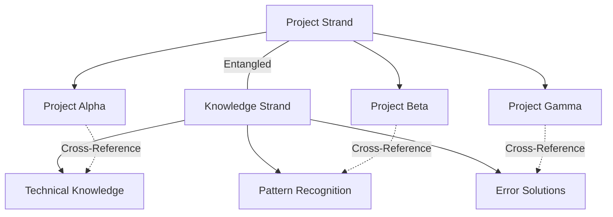

# Quantum Vector Memory Architecture for Multi-Project Development

## An Unconventional Approach to AI Memory Using Qdrant MCP

### 🌌 The Vision: Memory as a Living Ecosystem

Instead of traditional flat storage, we're creating a **quantum-inspired memory ecosystem** where memories exist in multiple states simultaneously, evolve over time, and form emergent patterns that enhance retrieval efficiency.

## 🧬 Core Architecture: The DNA Helix Model

### 1. **Dual-Strand Memory Structure**



**Implementation:**

```json
{
  "memory_dna": {
    "project_strand": {
      "collection": "ProjectMemories",
      "vector_field": "project_context",
      "dimension": 768
    },
    "knowledge_strand": {
      "collection": "UniversalKnowledge",
      "vector_field": "knowledge_essence",
      "dimension": 768
    },
    "entanglement_matrix": {
      "collection": "QuantumEntanglements",
      "vector_field": "relationship_vector",
      "dimension": 384
    }
  }
}
```

### 2. **Quantum Superposition Collections**

Instead of storing memories in one state, each memory exists in multiple "quantum states":

```python
# Memory Superposition Structure
memory_states = {
    "collapsed": {  # The actual memory as observed
        "content": "Implemented OAuth2 authentication",
        "project": "ProjectAlpha",
        "timestamp": "2024-01-30T10:00:00Z"
    },
    "potential": {  # What this memory could become
        "applications": ["security_pattern", "auth_template", "api_design"],
        "evolution_paths": ["microservice_auth", "jwt_implementation"],
        "cross_project_value": 0.95
    },
    "entangled": {  # Memories quantum-entangled with this one
        "related_memories": ["mem_auth_001", "mem_security_042"],
        "entanglement_strength": [0.87, 0.73],
        "synchronization_state": "coherent"
    }
}
```

### 3. **Time-Crystal Memory Organization**

Memories are organized in repeating patterns across time dimensions:

```yaml
time_crystal_structure:
  daily_pattern:
    - morning: "problem_identification"
    - afternoon: "solution_implementation"
    - evening: "reflection_consolidation"

  weekly_pattern:
    - monday-tuesday: "exploration"
    - wednesday-thursday: "deep_work"
    - friday: "integration"

  project_lifecycle:
    - inception: "broad_exploration"
    - development: "focused_implementation"
    - maturity: "optimization_patterns"
```

## 🎭 The Collections Symphony

### Primary Collections

#### 1. **ProjectMemories** - The Living Projects

```python
# Collection Configuration
{
    "name": "ProjectMemories",
    "vectors": {
        "context_vector": {"size": 768, "distance": "Cosine"},
        "emotion_vector": {"size": 384, "distance": "Euclid"},
        "complexity_vector": {"size": 256, "distance": "Dot"}
    },
    "payload_schema": {
        "project_id": "keyword",
        "lifecycle_stage": "keyword",
        "memory_type": "keyword",
        "confidence": "float",
        "evolution_score": "float",
        "quantum_state": "keyword",
        "entangled_with": "keyword[]",
        "temporal_anchor": "datetime"
    }
}
```

#### 2. **UniversalKnowledge** - The Collective Wisdom

```python
{
    "name": "UniversalKnowledge",
    "vectors": {
        "knowledge_essence": {"size": 768, "distance": "Cosine"},
        "abstraction_level": {"size": 512, "distance": "Manhattan"}
    },
    "payload_schema": {
        "knowledge_domain": "keyword",
        "abstraction_tier": "integer",  # 1-5, from concrete to abstract
        "reusability_score": "float",
        "mutation_count": "integer",
        "origin_projects": "keyword[]",
        "evolution_history": "text"
    }
}
```

#### 3. **QuantumEntanglements** - The Relationship Web

```python
{
    "name": "QuantumEntanglements",
    "vectors": {
        "relationship_vector": {"size": 384, "distance": "Cosine"}
    },
    "payload_schema": {
        "memory_pair": "keyword[]",
        "entanglement_type": "keyword",  # causal, correlational, emergent
        "strength": "float",
        "bidirectional": "bool",
        "resonance_frequency": "float"
    }
}
```

#### 4. **TemporalEchoes** - Memory Across Time

```python
{
    "name": "TemporalEchoes",
    "vectors": {
        "temporal_signature": {"size": 512, "distance": "Cosine"}
    },
    "payload_schema": {
        "original_memory": "keyword",
        "echo_type": "keyword",  # prediction, reflection, pattern
        "temporal_distance": "integer",  # days from original
        "accuracy_score": "float",
        "manifestation_count": "integer"
    }
}
```

## 🌊 The Flow: Memory Lifecycle

### 1. **Memory Inception** - The Quantum Collapse

When a new memory is created, it doesn't just get stored - it undergoes quantum collapse:

```python
async def quantum_memory_inception(memory_content, context):
    # Generate multiple vector representations
    vectors = {
        "primary": embed_with_context(memory_content, context),
        "emotional": extract_emotional_vector(memory_content),
        "complexity": analyze_complexity_vector(memory_content)
    }

    # Determine quantum states
    quantum_states = {
        "collapsed": memory_content,
        "superposition": generate_potential_applications(memory_content),
        "entangled": find_quantum_entanglements(vectors["primary"])
    }

    # Store in multiple collections simultaneously
    await parallel_store([
        store_project_memory(vectors, quantum_states),
        extract_universal_knowledge(memory_content),
        create_entanglements(quantum_states["entangled"]),
        project_temporal_echoes(memory_content)
    ])
```

### 2. **Memory Evolution** - The Living System

Memories don't stay static - they evolve based on usage and context:

```python
class MemoryEvolution:
    def __init__(self):
        self.evolution_rules = {
            "high_access": self.strengthen_vectors,
            "cross_project_use": self.promote_to_universal,
            "error_correction": self.update_confidence,
            "pattern_emergence": self.create_meta_memory
        }

    async def evolve_memory(self, memory_id, interaction_type):
        memory = await fetch_memory(memory_id)

        # Apply evolution based on interaction
        if interaction_type == "successful_application":
            memory.evolution_score *= 1.1
            memory.confidence = min(0.99, memory.confidence + 0.05)

        # Check for emergence patterns
        if memory.evolution_score > EMERGENCE_THRESHOLD:
            await self.trigger_emergence(memory)
```

### 3. **Quantum Retrieval** - Multi-Dimensional Search

```python
async def quantum_retrieve(query, context):
    # Phase 1: Superposition Search
    # Search across all possible states simultaneously
    superposition_results = await parallel_search([
        search_by_content(query),
        search_by_emotion(extract_emotion(query)),
        search_by_complexity(analyze_complexity(query)),
        search_by_temporal_pattern(context.time_pattern)
    ])

    # Phase 2: Quantum Entanglement Expansion
    # Follow entangled memories
    entangled_memories = await expand_through_entanglements(
        superposition_results,
        max_hops=3,
        min_strength=0.7
    )

    # Phase 3: Collapse to Reality
    # Select most relevant based on current context
    collapsed_results = quantum_collapse(
        superposition_results + entangled_memories,
        context,
        top_k=10
    )

    return collapsed_results
```

## 🎨 Creative Memory Patterns

### 1. **The Constellation Pattern**

Memories form constellations - groups that together tell a story:

```python
constellation_example = {
    "constellation_id": "auth_implementation_saga",
    "stars": [
        {"memory": "initial_auth_research", "brightness": 0.6},
        {"memory": "oauth_implementation", "brightness": 0.9},
        {"memory": "jwt_debugging", "brightness": 0.8},
        {"memory": "production_deployment", "brightness": 1.0}
    ],
    "constellation_story": "The journey from auth confusion to mastery",
    "navigational_value": 0.95  # How useful for future similar journeys
}
```

### 2. **The Resonance Chamber**

Memories that resonate together amplify their retrieval strength:

```python
resonance_configuration = {
    "chamber_id": "performance_optimization",
    "resonating_memories": [
        "database_indexing_success",
        "caching_strategy_implementation",
        "algorithm_optimization_pattern"
    ],
    "resonance_frequency": 440,  # Hz metaphor for harmony
    "amplification_factor": 2.5
}
```

### 3. **The Memory Garden**

Memories grow and cross-pollinate:

```python
memory_garden = {
    "garden_zones": {
        "seedlings": "new_unproven_memories",
        "growing": "developing_patterns",
        "blooming": "proven_solutions",
        "seeds": "extracted_patterns_for_future"
    },
    "cross_pollination_rules": {
        "similar_projects": 0.8,
        "different_domains": 0.3,
        "temporal_proximity": 0.6
    }
}
```

## 🚀 Implementation Guide

### Phase 1: Foundation (Week 1)

```bash
# Create the quantum collections
curl -X PUT http://localhost:6333/collections/ProjectMemories \
  -H 'Content-Type: application/json' \
  -d '{
    "vectors": {
      "context_vector": {"size": 768, "distance": "Cosine"},
      "emotion_vector": {"size": 384, "distance": "Euclid"}
    }
  }'

# Set up entanglement tracking
curl -X PUT http://localhost:6333/collections/QuantumEntanglements \
  -H 'Content-Type: application/json' \
  -d '{
    "vectors": {
      "relationship_vector": {"size": 384, "distance": "Cosine"}
    }
  }'
```

### Phase 2: Memory Inception System (Week 2)

```python
# Implement the quantum memory storage
async def store_quantum_memory(content, project_id):
    # Generate multi-dimensional embeddings
    embeddings = await generate_quantum_embeddings(content)

    # Create memory in superposition
    memory_states = create_superposition_states(content, project_id)

    # Store across collections
    await store_with_entanglements(embeddings, memory_states)
```

### Phase 3: Evolution Engine (Week 3)

```python
# Set up the evolution system
evolution_engine = MemoryEvolutionEngine(
    evolution_rate=0.1,
    emergence_threshold=0.85,
    cross_pollination_enabled=True
)

# Schedule regular evolution cycles
schedule.every(1).hours.do(evolution_engine.evolve_all_memories)
```

### Phase 4: Quantum Retrieval (Week 4)

```python
# Implement the multi-dimensional search
quantum_searcher = QuantumSearchEngine(
    superposition_enabled=True,
    entanglement_depth=3,
    collapse_strategy="context_weighted"
)
```

## 📊 Monitoring & Optimization

### Memory Health Metrics

```python
health_metrics = {
    "memory_coherence": 0.92,  # How well memories relate
    "evolution_rate": 0.15,    # How fast memories improve
    "entanglement_density": 0.73,  # Connection richness
    "retrieval_efficiency": 0.89,  # Speed vs relevance
    "emergence_frequency": 0.12  # New pattern creation rate
}
```

### Optimization Strategies

1. **Quantum Annealing**: Periodically reorganize memories for optimal retrieval
2. **Entanglement Pruning**: Remove weak connections to maintain performance
3. **Memory Consolidation**: Merge similar memories into higher-order patterns
4. **Temporal Compression**: Archive old memories while preserving their essence

## 🌟 Advanced Features

### 1. **Predictive Memory Synthesis**

The system predicts what memories you'll need before you ask:

```python
async def predictive_synthesis(current_context):
    # Analyze current work pattern
    pattern = analyze_work_pattern(current_context)

    # Predict next likely needs
    predictions = await quantum_predict(pattern)

    # Pre-synthesize relevant memories
    synthesized = await synthesize_memories(predictions)

    return synthesized
```

### 2. **Cross-Project Memory Tunneling**

Create quantum tunnels between projects for instant knowledge transfer:

```python
tunnel_configuration = {
    "source_project": "ProjectAlpha",
    "target_project": "ProjectBeta",
    "tunnel_filters": ["applicable_patterns", "reusable_solutions"],
    "transformation_rules": {
        "context_adaptation": True,
        "abstraction_level": 2
    }
}
```

### 3. **Memory Dreamscapes**

Let the system "dream" - creating new connections while idle:

```python
async def memory_dreaming():
    while system_idle():
        # Random walk through memory space
        random_memories = select_random_memories(n=10)

        # Find unexpected connections
        new_connections = find_novel_relationships(random_memories)

        # Store promising discoveries
        if new_connections.novelty_score > 0.8:
            await store_dream_insights(new_connections)
```

## 🎯 Success Metrics

### Quantitative

- **Retrieval Speed**: <50ms for 95% of queries
- **Relevance Score**: >0.85 average
- **Cross-Project Reuse**: >40% of memories
- **Evolution Rate**: 15% monthly improvement

### Qualitative

- **Serendipitous Discoveries**: Unexpected useful connections
- **Reduced Cognitive Load**: Less mental effort to find information
- **Emergent Intelligence**: System suggests solutions before problems arise
- **Creative Inspiration**: Memory combinations spark new ideas

## 🔮 Future Expansions

1. **Quantum Memory Entanglement with External Systems**

   - Connect with GitHub, Stack Overflow, Documentation
   - Create universal knowledge graph

2. **Temporal Memory Projection**

   - Predict future memory needs
   - Pre-generate solution patterns

3. **Collective Intelligence Networks**

   - Share anonymized patterns across users
   - Build universal development wisdom

4. **Memory Visualization in VR**
   - Navigate memory space in 3D
   - See connections as physical paths

## 🎭 Conclusion: Memory as Art

This architecture treats memory not as static storage but as a living, breathing ecosystem that grows, evolves, and creates emergent intelligence. By embracing quantum-inspired principles and creative organization patterns, we transform memory retrieval from a search problem into a journey of discovery.

The system doesn't just remember - it understands, predicts, and inspires. It's not just a memory system; it's a creative partner in the development process.

---

_"In the quantum realm of memory, every recollection exists in infinite states until the moment of retrieval collapses it into exactly what you need."_

## 🚀 Quick Start Implementation

```bash
# Clone the quantum memory starter
git clone https://github.com/your-repo/quantum-vector-memory

# Install dependencies
npm install

# Initialize Qdrant collections
npm run init:quantum-collections

# Start the evolution engine
npm run start:evolution

# Begin storing memories
npm run quantum:store "Your first quantum memory"
```

Remember: This is not just a memory system - it's a new way of thinking about how AI assistants can truly learn and evolve with their users across multiple projects. The unconventional approach ensures that as your projects grow, your AI's understanding grows exponentially, not linearly.
