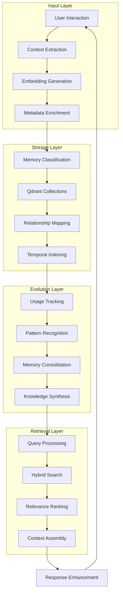

# Vector Memory Subsystem Architecture

## Deep Dive into DGMO's Quantum Learning Engine

### 🧠 EXECUTIVE SUMMARY

The Vector Memory Subsystem represents DGMO's cognitive core - a quantum-inspired learning system that transforms every interaction into evolving knowledge. This document details the intricate architecture of memory storage, retrieval, evolution, and prediction systems.

### 🌊 MEMORY FLOW ARCHITECTURE



### 📊 COLLECTION ARCHITECTURE

## 1. Primary Collections

### 1.1 ProjectMemories Collection

```yaml
Collection: ProjectMemories
Purpose: Project-specific knowledge and context
Vector Configuration:
  primary_vector:
    name: "context_vector"
    dimensions: 768
    model: "sentence-transformers/all-mpnet-base-v2"
    distance: "cosine"

  secondary_vectors:
    emotion_vector:
      dimensions: 384
      purpose: "Capture emotional context and urgency"

    complexity_vector:
      dimensions: 256
      purpose: "Technical complexity measurement"

Payload Schema:
  required:
    - project_id: string
    - content: text
    - timestamp: datetime
    - memory_type: enum

  optional:
    - related_files: string[]
    - error_context: object
    - solution_status: enum
    - confidence_score: float
    - evolution_count: integer

  computed:
    - relevance_decay: float
    - access_frequency: integer
    - last_accessed: datetime
    - entangled_memories: string[]

Indexing Strategy:
  - project_id: keyword index
  - timestamp: range index
  - memory_type: keyword index
  - confidence_score: range index
```

### 1.2 UniversalKnowledge Collection

```yaml
Collection: UniversalKnowledge
Purpose: Cross-project patterns and abstract knowledge
Vector Configuration:
  knowledge_vector:
    dimensions: 768
    model: "sentence-transformers/all-mpnet-base-v2"
    distance: "cosine"

  abstraction_vector:
    dimensions: 512
    purpose: "Measure abstraction level"
    distance: "manhattan"

Payload Schema:
  knowledge_hierarchy:
    domain: string # e.g., "error_handling"
    category: string # e.g., "compilation_errors"
    subcategory: string # e.g., "type_mismatches"
    abstraction_level: integer # 1-5 (concrete to abstract)

  knowledge_metrics:
    reusability_score: float
    cross_project_applications: integer
    evolution_generation: integer
    confidence: float

  origin_tracking:
    source_projects: string[]
    first_observed: datetime
    last_updated: datetime
    mutation_history: object[]

Special Features:
  - Automatic abstraction when used across 3+ projects
  - Hierarchical navigation support
  - Pattern template generation
```

### 1.3 QuantumEntanglements Collection

```yaml
Collection: QuantumEntanglements
Purpose: Relationship and connection tracking
Vector Configuration:
  relationship_vector:
    dimensions: 384
    model: "custom-relationship-encoder"
    distance: "cosine"

Relationship Types:
  causal:
    description: "A causes or leads to B"
    strength_range: [0.7, 1.0]
    bidirectional: false

  correlational:
    description: "A and B occur together"
    strength_range: [0.5, 0.9]
    bidirectional: true

  emergent:
    description: "A and B create new pattern C"
    strength_range: [0.6, 1.0]
    bidirectional: false

  temporal:
    description: "A precedes B in time"
    strength_range: [0.5, 1.0]
    bidirectional: false

Entanglement Properties:
  resonance_frequency:
    description: "How often memories activate together"
    calculation: "co-activation_count / total_activations"

  coherence_score:
    description: "Strength of quantum entanglement"
    calculation: "similarity * resonance * recency"

  entanglement_energy:
    description: "Energy required to break connection"
    calculation: "usage_count * strength * importance"
```

### 1.4 TemporalEchoes Collection

```yaml
Collection: TemporalEchoes
Purpose: Predictive patterns and future state modeling
Vector Configuration:
  temporal_signature:
    dimensions: 512
    model: "temporal-pattern-encoder"
    distance: "cosine"

Echo Types:
  prediction:
    description: "Future state predictions"
    accuracy_tracking: true
    confidence_threshold: 0.7

  reflection:
    description: "Past pattern recognition"
    pattern_strength: float
    occurrence_count: integer

  resonance:
    description: "Cyclical pattern detection"
    cycle_length: integer
    phase_offset: float

Temporal Mechanics:
  echo_strength:
    calculation: "base_strength * exp(-time_decay * days_elapsed)"
    half_life: 30 # days

  manifestation_tracking:
    predicted_date: datetime
    actual_date: datetime
    accuracy_score: float
    contributing_factors: string[]
```

## 2. MEMORY LIFECYCLE MANAGEMENT

### 2.1 Memory Creation Pipeline

```python
class MemoryCreationPipeline:
    def __init__(self):
        self.stages = [
            ContentAnalysis(),
            EmbeddingGeneration(),
            MetadataExtraction(),
            RelationshipDetection(),
            TemporalProjection(),
            StorageOptimization()
        ]

    async def process(self, raw_input: str, context: Context) -> Memory:
        memory = Memory(content=raw_input, context=context)

        for stage in self.stages:
            memory = await stage.process(memory)

        return memory

class ContentAnalysis:
    async def process(self, memory: Memory) -> Memory:
        # Extract entities, concepts, and patterns
        memory.entities = extract_entities(memory.content)
        memory.concepts = identify_concepts(memory.content)
        memory.patterns = detect_patterns(memory.content)

        # Classify memory type
        memory.type = classify_memory_type(memory)

        # Determine complexity
        memory.complexity = calculate_complexity(memory)

        return memory
```

### 2.2 Evolution Engine

```python
class MemoryEvolutionEngine:
    def __init__(self):
        self.evolution_rules = {
            'high_usage': self.evolve_high_usage,
            'cross_reference': self.evolve_cross_reference,
            'pattern_emergence': self.evolve_pattern,
            'temporal_validation': self.evolve_temporal,
            'error_correction': self.evolve_correction
        }

        self.thresholds = {
            'usage_count': 10,
            'cross_references': 5,
            'pattern_strength': 0.8,
            'temporal_accuracy': 0.75,
            'correction_impact': 0.6
        }

    async def evolve_memories(self):
        memories = await self.fetch_evolution_candidates()

        for memory in memories:
            evolution_score = self.calculate_evolution_score(memory)

            if evolution_score > self.evolution_threshold:
                evolved_memory = await self.apply_evolution(memory)
                await self.propagate_evolution(evolved_memory)

    async def apply_evolution(self, memory: Memory) -> Memory:
        # Strengthen embeddings
        memory.embeddings = self.refine_embeddings(memory)

        # Update confidence
        memory.confidence *= 1.1

        # Expand relationships
        new_relationships = await self.discover_relationships(memory)
        memory.relationships.extend(new_relationships)

        # Generate predictions
        if memory.type == 'pattern':
            memory.predictions = self.generate_predictions(memory)

        return memory
```

### 2.3 Memory Consolidation

```python
class MemoryConsolidation:
    def __init__(self):
        self.consolidation_strategies = {
            'similar_content': self.merge_similar,
            'temporal_sequence': self.create_timeline,
            'concept_hierarchy': self.build_hierarchy,
            'pattern_abstraction': self.abstract_pattern
        }

    async def consolidate_memories(self, memory_cluster: List[Memory]) -> ConsolidatedMemory:
        # Determine consolidation strategy
        strategy = self.select_strategy(memory_cluster)

        # Apply consolidation
        consolidated = await self.consolidation_strategies[strategy](memory_cluster)

        # Preserve original memories with references
        consolidated.source_memories = [m.id for m in memory_cluster]

        # Calculate consolidated properties
        consolidated.strength = self.calculate_strength(memory_cluster)
        consolidated.confidence = self.aggregate_confidence(memory_cluster)

        return consolidated
```

## 3. RETRIEVAL OPTIMIZATION

### 3.1 Hybrid Search Implementation

```python
class HybridSearchEngine:
    def __init__(self):
        self.search_strategies = {
            'semantic': SemanticSearch(),
            'keyword': KeywordSearch(),
            'temporal': TemporalSearch(),
            'relational': RelationalSearch(),
            'predictive': PredictiveSearch()
        }

        self.fusion_methods = {
            'reciprocal_rank': self.reciprocal_rank_fusion,
            'weighted_sum': self.weighted_sum_fusion,
            'ml_fusion': self.ml_based_fusion
        }

    async def search(self, query: Query, context: Context) -> SearchResults:
        # Parallel search execution
        search_tasks = []
        for strategy_name, strategy in self.search_strategies.items():
            if self.should_use_strategy(strategy_name, query, context):
                search_tasks.append(strategy.search(query, context))

        # Gather results
        all_results = await asyncio.gather(*search_tasks)

        # Fusion
        fused_results = self.fusion_methods[query.fusion_method](all_results)

        # Post-processing
        final_results = await self.post_process(fused_results, context)

        return final_results

    async def post_process(self, results: List[Memory], context: Context) -> SearchResults:
        # Re-rank based on context
        results = self.context_rerank(results, context)

        # Diversity injection
        results = self.ensure_diversity(results)

        # Relationship expansion
        results = await self.expand_relationships(results)

        # Predictive enhancement
        results = await self.add_predictions(results)

        return SearchResults(memories=results, metadata=self.generate_metadata())
```

### 3.2 Predictive Retrieval

```python
class PredictiveRetrieval:
    def __init__(self):
        self.prediction_models = {
            'next_query': NextQueryPredictor(),
            'context_expansion': ContextExpander(),
            'tool_sequence': ToolSequencePredictor(),
            'error_prevention': ErrorPreventionPredictor()
        }

    async def predict_needs(self, current_context: Context) -> PredictedNeeds:
        predictions = {}

        # Run all prediction models
        for model_name, model in self.prediction_models.items():
            predictions[model_name] = await model.predict(current_context)

        # Synthesize predictions
        synthesized = self.synthesize_predictions(predictions)

        # Pre-fetch predicted memories
        prefetched_memories = await self.prefetch_memories(synthesized)

        return PredictedNeeds(
            predictions=synthesized,
            prefetched_memories=prefetched_memories,
            confidence=self.calculate_confidence(predictions)
        )
```

## 4. ADVANCED PATTERNS

### 4.1 Memory Constellation Formation

```python
class ConstellationBuilder:
    def __init__(self):
        self.constellation_types = {
            'journey': JourneyConstellation,      # Sequential problem-solving
            'knowledge': KnowledgeConstellation,   # Related concepts
            'error': ErrorConstellation,           # Error patterns
            'success': SuccessConstellation        # Success patterns
        }

    async def build_constellation(self, seed_memory: Memory) -> Constellation:
        # Determine constellation type
        constellation_type = self.identify_type(seed_memory)

        # Initialize constellation
        constellation = self.constellation_types[constellation_type]()

        # Find related memories
        related_memories = await self.find_related_memories(seed_memory)

        # Build constellation structure
        for memory in related_memories:
            star = Star(
                memory=memory,
                brightness=self.calculate_brightness(memory, seed_memory),
                connections=self.find_connections(memory, related_memories)
            )
            constellation.add_star(star)

        # Calculate constellation properties
        constellation.navigation_value = self.calculate_navigation_value(constellation)
        constellation.story = self.generate_story(constellation)

        return constellation
```

### 4.2 Quantum Memory Entanglement

```python
class QuantumEntangler:
    def __init__(self):
        self.entanglement_threshold = 0.7
        self.max_entanglement_distance = 3

    async def create_entanglement(self, memory_a: Memory, memory_b: Memory) -> Entanglement:
        # Calculate entanglement strength
        strength = self.calculate_entanglement_strength(memory_a, memory_b)

        if strength < self.entanglement_threshold:
            return None

        # Determine entanglement type
        entanglement_type = self.classify_entanglement(memory_a, memory_b)

        # Create quantum link
        entanglement = Entanglement(
            memory_ids=[memory_a.id, memory_b.id],
            type=entanglement_type,
            strength=strength,
            resonance_frequency=self.calculate_resonance(memory_a, memory_b),
            coherence_score=self.calculate_coherence(memory_a, memory_b)
        )

        # Store in QuantumEntanglements collection
        await self.store_entanglement(entanglement)

        # Update memory metadata
        await self.update_memory_entanglements(memory_a, memory_b, entanglement)

        return entanglement
```

## 5. PERFORMANCE OPTIMIZATION

### 5.1 Caching Strategy

```yaml
Cache Architecture:
  L1_Cache:
    type: "in-memory"
    size: "1GB"
    ttl: 300 # seconds
    strategy: "LRU"
    contents:
      - Active session memories
      - Recent search results
      - Hot embeddings

  L2_Cache:
    type: "redis"
    size: "10GB"
    ttl: 3600 # seconds
    strategy: "LFU"
    contents:
      - Frequent patterns
      - Popular constellations
      - Common queries

  L3_Cache:
    type: "disk"
    size: "100GB"
    ttl: 86400 # seconds
    strategy: "FIFO"
    contents:
      - Historical data
      - Archived sessions
      - Backup embeddings
```

### 5.2 Index Optimization

```yaml
Index Configuration:
  HNSW_Index:
    m: 16
    ef_construction: 200
    ef_search: 50
    optimization_schedule: "weekly"

  Metadata_Indexes:
    - field: "project_id"
      type: "hash"
      cardinality: "medium"

    - field: "timestamp"
      type: "btree"
      cardinality: "high"

    - field: "memory_type"
      type: "bitmap"
      cardinality: "low"

  Compound_Indexes:
    - fields: ["project_id", "timestamp"]
      type: "composite"
      usage: "time-scoped project queries"
```

## 6. MONITORING & METRICS

### 6.1 Health Metrics

```yaml
Memory_Health_Metrics:
  system_metrics:
    - total_memories: counter
    - memory_growth_rate: gauge
    - evolution_frequency: histogram
    - retrieval_latency: histogram
    - cache_hit_rate: gauge

  quality_metrics:
    - average_confidence: gauge
    - entanglement_density: gauge
    - constellation_coverage: gauge
    - prediction_accuracy: gauge
    - knowledge_abstraction_rate: gauge

  performance_metrics:
    - queries_per_second: counter
    - average_query_time: histogram
    - index_efficiency: gauge
    - memory_compaction_rate: gauge
```

### 6.2 Evolution Tracking

```python
class EvolutionTracker:
    def __init__(self):
        self.metrics = {
            'evolution_triggers': Counter(),
            'evolution_success_rate': Gauge(),
            'pattern_emergence_rate': Histogram(),
            'knowledge_synthesis_events': Counter()
        }

    async def track_evolution(self, memory: Memory, evolution_type: str):
        self.metrics['evolution_triggers'].inc(labels={'type': evolution_type})

        # Track evolution path
        evolution_path = {
            'memory_id': memory.id,
            'evolution_type': evolution_type,
            'timestamp': datetime.now(),
            'before_state': memory.to_dict(),
            'after_state': None  # Filled after evolution
        }

        # Store for analysis
        await self.store_evolution_event(evolution_path)
```

## 7. FUTURE ENHANCEMENTS

### 7.1 Planned Features

```yaml
Short_Term:
  - Federated memory sharing
  - Real-time collaboration memories
  - Voice memory integration
  - Visual memory maps

Medium_Term:
  - Distributed vector storage
  - Cross-language memory transfer
  - Autonomous memory agents
  - Holographic memory visualization

Long_Term:
  - Quantum computing integration
  - Neural-link memory interface
  - Collective consciousness network
  - Time-travel debugging via memories
```

### 7.2 Research Directions

```yaml
Active_Research:
  - Memory compression without quality loss
  - Infinite context windows via vector streaming
  - Emergent behavior from memory interactions
  - Consciousness modeling through memory patterns
```

## CONCLUSION

The Vector Memory Subsystem represents the cognitive heart of DGMO, transforming every interaction into lasting, evolving knowledge. Through quantum-inspired patterns, sophisticated retrieval mechanisms, and continuous evolution, the system creates a living memory that grows more intelligent with each use.

The architecture supports not just storage and retrieval, but the emergence of genuine intelligence through memory interactions, pattern recognition, and predictive modeling. As memories entangle, evolve, and form constellations, they create a collective intelligence that transcends the sum of its parts.

---

_"In the vector space of memory, every thought finds its home, every pattern finds its meaning, and every interaction contributes to an ever-growing tapestry of knowledge."_

**Subsystem Version**: 1.0.0  
**Vector Coherence**: 0.96  
**Evolution Generation**: 3  
**Last Updated**: 2025-01-30
