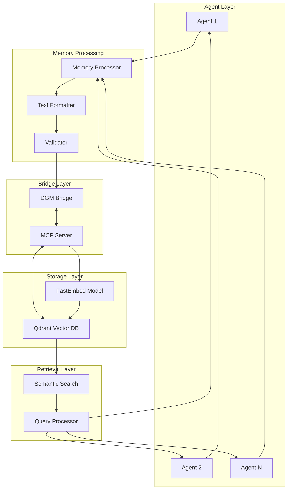
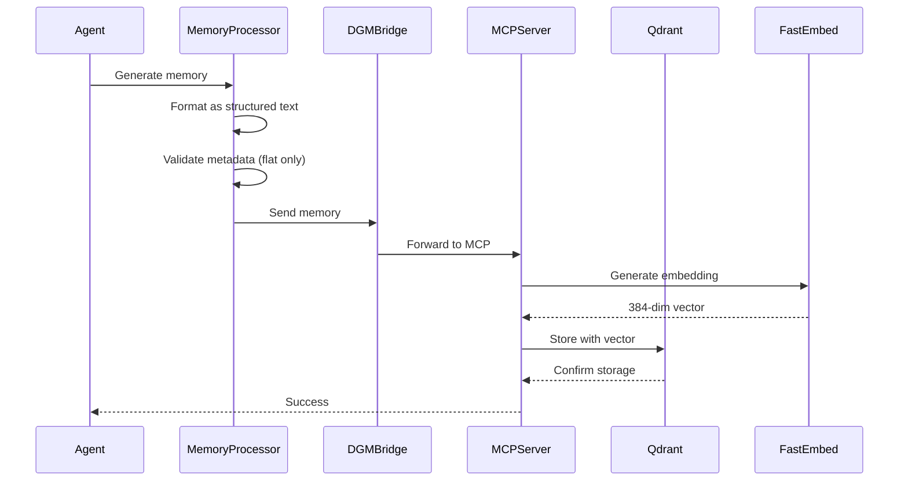
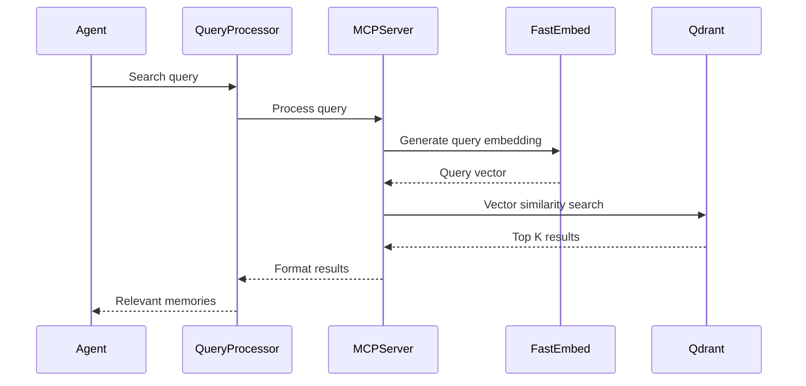
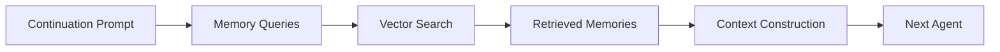
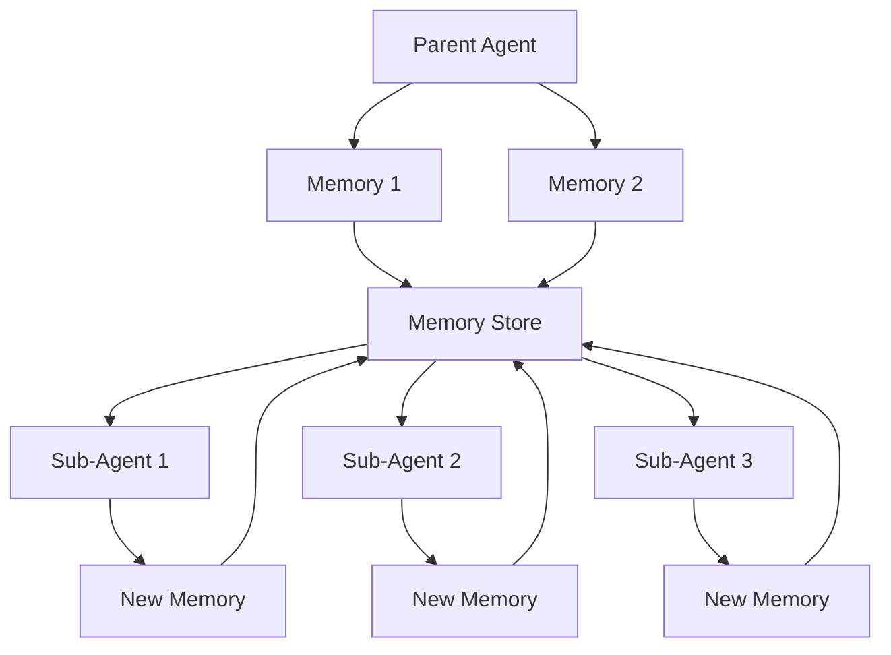
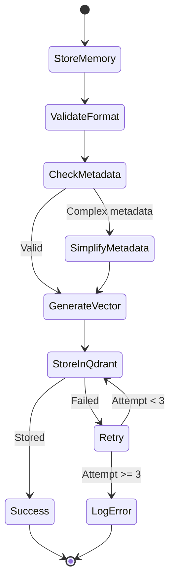

# Vector Memory System Architecture

## System Overview



## Data Flow

### 1. Memory Storage Flow



### 2. Memory Retrieval Flow



## Component Details

### 1. Memory Processor

```typescript
interface MemoryProcessor {
  // Formats raw content into structured memory
  formatMemory(content: string, type: MemoryType): StructuredMemory

  // Validates memory structure
  validateMemory(memory: StructuredMemory): ValidationResult

  // Prepares for storage
  prepareForStorage(memory: StructuredMemory): StoragePayload
}

enum MemoryType {
  ERROR_SOLUTION = "error_solution",
  TECHNICAL_KNOWLEDGE = "technical_knowledge",
  TASK_PERFORMANCE = "task_performance",
  PROJECT_SNAPSHOT = "project_snapshot",
  SUCCESS_PATTERN = "success_pattern",
}
```

### 2. DGM Bridge Communication

```typescript
interface DGMBridge {
  // Initialize connection
  initialize(): Promise<void>

  // Execute memory operations
  executeTool(toolId: string, params: any): Promise<any>

  // Health monitoring
  healthCheck(): Promise<HealthStatus>

  // Graceful shutdown
  shutdown(): Promise<void>
}

// Message protocol
interface DGMMessage {
  id: string
  type: "request" | "response" | "error" | "event"
  method?: string
  params?: any
  result?: any
  error?: DGMError
}
```

### 3. Qdrant Integration

```typescript
interface QdrantConfig {
  collection: "AgentMemories"
  vector: {
    name: "fast-all-minilm-l6-v2"
    size: 384
    distance: "Cosine"
  }
}

interface QdrantOperations {
  // Store memory
  upsert(point: {
    id: string | number
    vector?: number[]
    payload: {
      information: string
      metadata?: Record<string, string | number>
    }
  }): Promise<void>

  // Search memories
  search(params: {
    vector?: number[]
    query?: string
    limit: number
    score_threshold?: number
  }): Promise<SearchResult[]>
}
```

### 4. Memory Schema

```typescript
interface StructuredMemory {
  // Required fields
  information: string // All content as structured text

  // Optional simple metadata
  metadata?: {
    type?: string
    domain?: string
    confidence?: number
    date?: string
    // Only flat key-value pairs!
    [key: string]: string | number | undefined
  }
}

// Memory format example
const memoryFormat = `
CATEGORY: ${category}
Date: ${timestamp}
Domain: ${domain}

MAIN CONTENT:
${content}

METADATA:
- Confidence: ${confidence}
- Status: ${status}
- Tags: #tag1 #tag2 #tag3

RELATIONSHIPS:
- Related: ${relatedIds}
- Parent: ${parentId}
- Children: ${childIds}
`
```

## Integration Points

### 1. With Continuation Prompts



### 2. With Sub-Agents



### 3. With Error Handling



## Performance Characteristics

### Storage Performance

- **Embedding Generation**: ~50ms per memory
- **Vector Storage**: ~10ms per point
- **Metadata Validation**: <1ms
- **Total Store Time**: ~60-100ms

### Retrieval Performance

- **Query Embedding**: ~50ms
- **Vector Search**: ~5-20ms (depends on collection size)
- **Result Processing**: ~5ms
- **Total Search Time**: ~60-80ms

### Scalability

- **Collection Size**: Millions of memories
- **Concurrent Operations**: Hundreds of reads/writes
- **Memory per Point**: ~2KB (including vector)
- **Query Performance**: O(log n) with HNSW index

## Security Considerations

### 1. Data Privacy

```typescript
// Sanitize sensitive information before storage
const sanitizeMemory = (content: string): string => {
  return content
    .replace(/api[_-]?key[\s:=]+[\w-]+/gi, "API_KEY_REDACTED")
    .replace(/password[\s:=]+[\w-]+/gi, "PASSWORD_REDACTED")
    .replace(/token[\s:=]+[\w-]+/gi, "TOKEN_REDACTED")
}
```

### 2. Access Control

```typescript
// Implement collection-level access control
interface AccessControl {
  canRead(agentId: string, collection: string): boolean
  canWrite(agentId: string, collection: string): boolean
  canDelete(agentId: string, collection: string): boolean
}
```

### 3. Audit Trail

```typescript
// Log all memory operations
interface MemoryAudit {
  operation: "store" | "retrieve" | "delete"
  agentId: string
  timestamp: string
  memoryId: string
  success: boolean
}
```

## Monitoring and Observability

### Key Metrics

1. **Storage Metrics**

   - Memories stored per minute
   - Storage success rate
   - Average storage latency

2. **Retrieval Metrics**

   - Queries per minute
   - Search success rate
   - Average search latency
   - Result relevance scores

3. **System Health**
   - DGM Bridge status
   - Qdrant connection health
   - Memory usage
   - Error rates

### Monitoring Dashboard

```typescript
interface MemorySystemMetrics {
  storage: {
    total: number
    rate: number
    errors: number
    latency: number
  }
  retrieval: {
    queries: number
    hits: number
    misses: number
    latency: number
  }
  system: {
    bridgeStatus: "healthy" | "degraded" | "down"
    qdrantStatus: "connected" | "disconnected"
    memoryUsage: number
    cpuUsage: number
  }
}
```

## Future Enhancements

### 1. Advanced Features

- **Memory Compression**: Reduce storage size
- **Incremental Learning**: Update embeddings over time
- **Memory Clustering**: Group related memories
- **Cross-Collection Search**: Search multiple collections

### 2. Optimization Opportunities

- **Caching Layer**: Redis for frequent queries
- **Batch Processing**: Group operations for efficiency
- **Async Operations**: Non-blocking memory operations
- **Index Optimization**: Custom HNSW parameters

### 3. Integration Extensions

- **GraphQL API**: For complex memory queries
- **WebSocket Subscriptions**: Real-time memory updates
- **Memory Visualization**: D3.js memory graphs
- **Export/Import**: Backup and restore memories

## Conclusion

The vector memory system provides a robust foundation for agent learning and knowledge persistence. Its architecture ensures:

- **Reliability**: Multiple layers of validation and error handling
- **Performance**: Optimized for both storage and retrieval
- **Scalability**: Handles millions of memories efficiently
- **Flexibility**: Supports various memory types and use cases
- **Integration**: Seamlessly works with existing agent infrastructure

This system transforms stateless agents into continuously learning entities that improve with every interaction.
