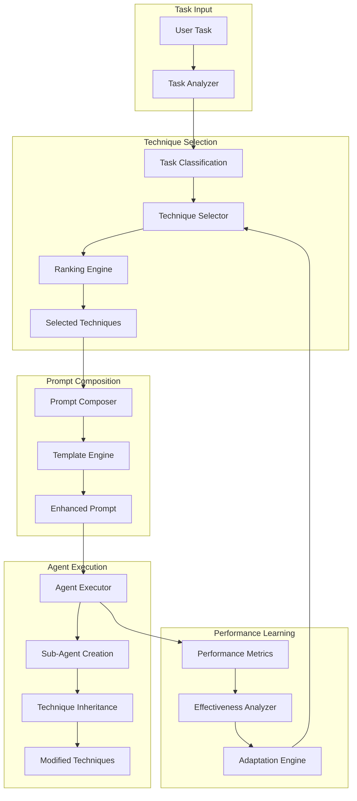

# DGMO Native Prompting Techniques Architecture

## Overview

This architecture integrates 18+ prompting techniques directly into DGMO's agent workflow, enabling automatic technique selection, composition, and performance tracking without MCP server dependencies.

## Core Design Principles

1. **Zero-Latency Access**: All techniques available in-memory (<50ms overhead)
2. **Automatic Selection**: Task analysis drives technique selection
3. **Composability**: Techniques can be combined and chained
4. **Inheritance**: Sub-agents inherit and modify parent techniques
5. **Learning System**: Continuous improvement through performance tracking

## Architecture Components

### 1. Technique Registry System

```
src/prompting/
├── registry/
│   ├── technique-registry.ts      # Core registry implementation
│   ├── technique-loader.ts        # Loads and validates techniques
│   └── technique-cache.ts         # In-memory technique storage
├── techniques/
│   ├── reasoning/
│   │   ├── chain-of-thought.ts
│   │   ├── tree-of-thoughts.ts
│   │   └── program-aided.ts
│   ├── generation/
│   │   ├── few-shot.ts
│   │   └── persona-based.ts
│   ├── multi-agent/
│   │   ├── coordination.ts
│   │   ├── communication-protocol.ts
│   │   ├── consensus-building.ts
│   │   └── hierarchical-decomposition.ts
│   ├── optimization/
│   │   ├── self-consistency.ts
│   │   ├── iterative-refinement.ts
│   │   └── active-prompt.ts
│   └── advanced/
│       ├── constitutional-ai.ts
│       ├── meta-prompting.ts
│       ├── generated-knowledge.ts
│       ├── prompt-chaining.ts
│       ├── react.ts
│       └── reflexion.ts
├── selector/
│   ├── technique-selector.ts      # Dynamic selection engine
│   ├── task-analyzer.ts          # Analyzes tasks for technique matching
│   └── selection-strategies.ts   # Different selection algorithms
├── composer/
│   ├── prompt-composer.ts        # Combines multiple techniques
│   ├── composition-rules.ts     # Rules for technique combination
│   └── template-engine.ts        # Template processing
├── inheritance/
│   ├── technique-inheritance.ts  # Sub-agent inheritance system
│   ├── modification-tracker.ts   # Tracks technique modifications
│   └── inheritance-chain.ts      # Manages inheritance hierarchy
├── learning/
│   ├── performance-tracker.ts    # Tracks technique effectiveness
│   ├── metrics-collector.ts      # Collects performance metrics
│   ├── effectiveness-analyzer.ts # Analyzes technique performance
│   └── adaptation-engine.ts      # Adapts selection based on learning
└── index.ts                      # Main export
```

### 2. Core TypeScript Interfaces

```typescript
// src/prompting/types.ts

export interface PromptingTechnique {
  id: string
  name: string
  category: TechniqueCategory
  description: string

  // Core functionality
  apply(context: TechniqueContext): Promise<EnhancedPrompt>
  validate(input: any): boolean

  // Metadata for selection
  complexity: ComplexityLevel
  suitableFor: TaskType[]
  incompatibleWith?: string[]
  requiredCapabilities?: Capability[]

  // Performance tracking
  metrics: TechniqueMetrics
}

export interface TechniqueContext {
  task: string
  parentContext?: TechniqueContext
  sessionId: string
  agentId: string
  variables: Record<string, any>
  constraints: Constraint[]
  previousTechniques: string[]
}

export interface EnhancedPrompt {
  content: string
  metadata: {
    techniques: string[]
    confidence: number
    estimatedTokens: number
    compositionStrategy: string
  }
  variables: Record<string, any>
  postProcessing?: PostProcessor[]
}

export interface TechniqueSelector {
  analyze(task: string, context: SelectionContext): Promise<TaskAnalysis>
  select(analysis: TaskAnalysis): Promise<SelectedTechniques>
  rank(techniques: PromptingTechnique[], task: TaskAnalysis): TechniqueScore[]
}

export interface PromptComposer {
  compose(
    techniques: PromptingTechnique[],
    context: TechniqueContext,
  ): Promise<EnhancedPrompt>
  validate(prompt: EnhancedPrompt): ValidationResult
  optimize(prompt: EnhancedPrompt): Promise<EnhancedPrompt>
}

export interface TechniqueInheritance {
  inherit(parent: TechniqueSet, modifications: Modification[]): TechniqueSet
  track(agentId: string, techniques: TechniqueSet): void
  getLineage(agentId: string): TechniqueLineage
}

export interface PerformanceTracker {
  record(execution: TechniqueExecution): Promise<void>
  analyze(techniqueId: string, timeframe: TimeFrame): PerformanceAnalysis
  recommend(task: TaskAnalysis): TechniqueRecommendation[]
}
```

### 3. Integration Points

```typescript
// src/prompting/integration/dgmo-integration.ts

export class DGMOPromptingIntegration {
  // Integration with Session Manager
  async enhanceSessionPrompt(
    sessionId: string,
    task: string,
  ): Promise<EnhancedPrompt> {
    const context = await this.buildContext(sessionId)
    const techniques = await this.selector.selectForTask(task, context)
    return this.composer.compose(techniques, context)
  }

  // Integration with Parallel Agents
  async prepareSubAgentTechniques(
    parentAgentId: string,
    subAgentTask: string,
    modifications?: TechniqueModification[],
  ): Promise<TechniqueSet> {
    const parentTechniques =
      await this.inheritance.getAgentTechniques(parentAgentId)
    const inherited = this.inheritance.inherit(
      parentTechniques,
      modifications || [],
    )

    // Adapt based on sub-agent specific task
    const taskAnalysis = await this.selector.analyze(subAgentTask)
    return this.adaptTechniques(inherited, taskAnalysis)
  }

  // Integration with Task Events
  async onTaskComplete(event: TaskCompleteEvent): Promise<void> {
    const execution: TechniqueExecution = {
      taskId: event.taskId,
      techniques: event.metadata.techniques,
      duration: event.duration,
      success: event.success,
      metrics: event.metrics,
    }

    await this.performanceTracker.record(execution)
  }
}
```

## Data Flow Architecture



## Implementation Phases

### Phase 1: Core Infrastructure (Week 1-2)

- [ ] Implement technique registry and loader
- [ ] Create base technique interfaces
- [ ] Build in-memory caching system
- [ ] Implement basic technique templates

**Milestone**: All 18 techniques loaded and accessible in <10ms

### Phase 2: Dynamic Selection (Week 3-4)

- [ ] Implement task analyzer with NLP capabilities
- [ ] Build technique selector with ranking
- [ ] Create selection strategies (greedy, probabilistic, learned)
- [ ] Implement compatibility checking

**Milestone**: Automatic technique selection with 80%+ accuracy

### Phase 3: Composition Engine (Week 5-6)

- [ ] Build prompt composer with template engine
- [ ] Implement composition rules and validation
- [ ] Create technique chaining system
- [ ] Add optimization passes

**Milestone**: Multi-technique prompts with <50ms composition time

### Phase 4: Inheritance System (Week 7-8)

- [ ] Implement technique inheritance for sub-agents
- [ ] Build modification tracking system
- [ ] Create lineage visualization
- [ ] Add inheritance policies

**Milestone**: Sub-agents inherit and modify techniques seamlessly

### Phase 5: Learning System (Week 9-10)

- [ ] Implement performance tracking infrastructure
- [ ] Build metrics collection pipeline
- [ ] Create effectiveness analyzer
- [ ] Implement adaptation engine

**Milestone**: 20%+ improvement in technique selection after 1000 executions

### Phase 6: Integration & Optimization (Week 11-12)

- [ ] Integrate with DGMO session manager
- [ ] Connect to parallel agent system
- [ ] Optimize for <50ms total overhead
- [ ] Add monitoring and debugging tools

**Milestone**: Full integration with <50ms latency overhead

## Performance Specifications

### Latency Requirements

- Technique loading: <10ms (cached)
- Task analysis: <20ms
- Technique selection: <10ms
- Prompt composition: <20ms
- Total overhead: <50ms

### Memory Requirements

- Technique registry: ~50MB
- Performance data: ~100MB (rolling window)
- Cache: ~200MB
- Total: <400MB per instance

### Scalability

- Support 1000+ concurrent agents
- Handle 10,000+ technique executions/minute
- Store 1M+ performance records

## Monitoring & Debugging

```typescript
// src/prompting/monitoring/technique-monitor.ts

export interface TechniqueMonitor {
  // Real-time metrics
  getActiveTehniques(): ActiveTechnique[]
  getSelectionLatency(): LatencyMetrics
  getCompositionStats(): CompositionStats

  // Debugging
  explainSelection(taskId: string): SelectionExplanation
  traceInheritance(agentId: string): InheritanceTrace
  analyzePerformance(techniqueId: string): PerformanceReport
}
```

## Security Considerations

1. **Technique Validation**: All techniques validated before execution
2. **Sandboxing**: Technique execution in isolated contexts
3. **Rate Limiting**: Prevent technique abuse
4. **Audit Trail**: Complete logging of technique usage

## Future Enhancements

1. **Custom Techniques**: User-defined prompting techniques
2. **Technique Marketplace**: Share and discover techniques
3. **A/B Testing**: Built-in experimentation framework
4. **Multi-Model Support**: Techniques optimized per model
5. **Visual Composer**: GUI for technique composition
